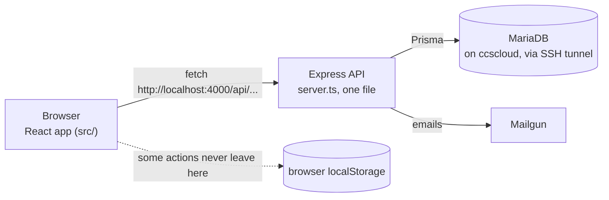

# 01E. Onboarding Roadmap

Project: CAP-2519-IT, Asset Management System for DLSU CCS AdRIC.
Date: 2026-09-18. Start here if you have never seen this project.

**Read this first, then follow the links.** This document assumes you know React and TypeScript at a basic level and have never worked on this codebase. It tells you what the system is, how to run it, what to read in what order, and which parts will mislead you.

---

## Table of contents

1. [What this system is](#1-what-this-system-is)
2. [The people who use it](#2-the-people-who-use-it)
3. [How the pieces fit together](#3-how-the-pieces-fit-together)
4. [Getting it running](#4-getting-it-running)
5. [Guided tour: read these in this order](#5-guided-tour-read-these-in-this-order)
6. [Where do I change this](#6-where-do-i-change-this)
7. [Vocabulary](#7-vocabulary)
8. [Traps for newcomers](#8-traps-for-newcomers)
9. [Where to go next](#9-where-to-go-next)

---

## 1. What this system is

- **Simple:** DLSU's Advanced Research Institute for Computing (AdRIC) owns expensive equipment: cameras, VR headsets, robot arms, servers. Those items live in ten research laboratories and move constantly, because students and faculty borrow them, hand them to each other, break them, and eventually retire them. This system is the record of where every item is, who is responsible for it, and what has happened to it. Each item carries a QR code sticker, and scanning it opens that item's page.
- **Technical:** A React and TypeScript single-page app, an Express and TypeScript API, and a MariaDB database reached through Prisma. The domain centers on one table, `asset_records`, which is an append-only log: each row is a snapshot of one asset's status, location, condition, and custodian at a moment in time. The newest row for an asset is its current state. Every workflow (loan, transfer, repair, return, disposal) writes a new row to that log when it completes.

The project received a **Conditional Pass** at its Stage 1 defense in August 2026. The panel's main criticism was that the database is underused: no triggers, no stored procedures, no versioned migrations, and no automation of data the system already holds. Phase 3 of the current work addresses that. This document set (01A to 01E) is the groundwork.

---

## 2. The people who use it

| Role in the app | Who they are | What they do |
|---|---|---|
| **Custodian** | A student or faculty member holding equipment | Borrows items, transfers custody to someone else, files repair requests, submits condition reports, scans QR codes, returns items |
| **Lab Head** | The academic in charge of one research lab | Approves or declines loans and transfers for their lab, approves new user accounts, views their lab's inventory and analytics |
| **ITS** and **TSG** | Information Technology Services, and the Technical Support Group | Register new equipment, edit records, run inspections, manage repairs, finalize returns, print QR tags, file disposal requests. **In practice these two roles are identical**, and the plan is to merge them ([01D section 1](01D-restructure-plan.md#1-the-decision-one-package-feature-folders)) |
| **AdRIC Director** | The institute director | Approves disposals, sees institution-wide analytics, generates audit documents, places clearance holds |

The database also knows `ADRIC_SECRETARY` and `ITS_STAFF`, but the app does not map them properly. See [Traps](#8-traps-for-newcomers).

---

## 3. How the pieces fit together

Three facts that explain most of what you will see:

1. **The backend is one file.** [server.ts](../../server.ts) is about 4,760 lines and holds all 62 endpoints, all business rules, and the email triggers. There are no controllers or services yet. [01D](01D-restructure-plan.md) is the plan to split it.
2. **Some screens write to the browser, not the database.** [src/app/prismaClient.ts](../../src/app/prismaClient.ts) is a fake Prisma client backed by `localStorage`. Several actions still use it, so they appear to work and change nothing real. This is the single biggest source of confusion in the project ([01A section 5.2](01A-system-trace.md#52-actions-that-never-reach-the-server)).
3. **An asset's current state is not a column.** It is the newest row in `asset_records`. If you want to know whether something is on loan, you read the log, not the asset.

---

## 4. Getting it running

Derived from [package.json](../../package.json) and the config files, not from the README. **The existing [README.md](../../README.md) is partly wrong**; the corrections are noted below.

### Prerequisites

- Node.js 20 or newer, npm 10 or newer.
- Access to the AdRIC MariaDB instance on `ccscloud.dlsu.edu.ph`. The README says the port must match your SSH tunnel, so ask the team for the tunnel command and the credentials. **Do not use the credentials you will find written inside `prisma.ts`; they are being rotated** ([01C tier 1](01C-security-map.md#tier-1-do-immediately-before-any-further-demo)).

### Steps

1. `npm install`
2. Create a `.env` file in the project root. There is no `.env.example` yet, so here are the names the code reads: `DATABASE_HOST`, `DATABASE_PORT`, `DATABASE_USER`, `DATABASE_PASSWORD`, `DATABASE_NAME` (used by [prisma.ts](../../prisma.ts)), `DATABASE_URL` (used by [prisma.config.ts](../../prisma.config.ts) for CLI commands), and optionally `MAILGUN_API_KEY`, `MAILGUN_DOMAIN`, `MAILGUN_FROM` for email.
3. `npm run prisma:generate`
4. `npm run dev:all`, or in two terminals `npm run server` and `npm run dev`.
5. Open the Vite URL it prints, and log in. Ask a teammate for a working account.

### Steps that are currently broken or misleading

| Thing | Reality |
|---|---|
| `npm run seed` | **Broken.** [test-user.ts](../../test-user.ts) writes columns that no longer exist and throws ([01B L-04](01B-findings-register.md)) |
| README's `generated/prisma/` folder | Does not exist. The generator is `prisma-client-js`, so the client lands in `node_modules`. Ignore that line |
| README says `.env` holds the connection | True in intent, but there is no `.env` in a fresh clone and the app **silently falls back to hardcoded credentials** instead of failing, so it may appear to work without one |
| Prisma CLI commands | `prisma db pull` and similar need `DATABASE_URL`, which is separate from the five variables the server uses. Set both or the CLI fails while the server works |
| Creating your own database | The only build script, [docs/reference/AdRIC_DB_Schema.sql](../reference/AdRIC_DB_Schema.sql), **does not run**: it has two syntax errors ([01B H-23](01B-findings-register.md)). This is why everyone shares one remote database, which is also why you should be careful: there is no staging environment |
| Type checking | There is no `tsconfig.json` and no typecheck script. Your editor may show errors that the build ignores. Trust the editor, not the build |
| Tests | There are none |

---

## 5. Guided tour: read these in this order

### Tour 1: logging in (about 20 minutes)

1. [src/app/components/Login.tsx#L20-L90](../../src/app/components/Login.tsx#L20-L90). The form and the submit handler. Note the fallback to the localStorage mock at the end.
2. [server.ts#L3886-L3951](../../server.ts#L3886-L3951). The login endpoint. Look at how the password is compared, and how one app role is chosen from a list of database roles.
3. [src/app/context.tsx#L466-L543](../../src/app/context.tsx#L466-L543). What "being logged in" actually means: three cookies and a lookup by email.
4. [src/app/layouts/RootLayout.tsx#L14-L26](../../src/app/layouts/RootLayout.tsx#L14-L26). The only route guard in the app.

**What you should conclude:** identity is an email address in a cookie, and the server never verifies it after login. That is finding C-06 and it is why [01C](01C-security-map.md) exists.

### Tour 2: borrowing an item, end to end (about 40 minutes)

1. [src/app/components/AssetDetailModal.tsx#L380-L400](../../src/app/components/AssetDetailModal.tsx#L380-L400). Where a Custodian gets the "Request Loan" button.
2. [src/app/components/LoanForm.tsx#L96-L130](../../src/app/components/LoanForm.tsx#L96-L130). The form, the POST, and the extra write to context afterwards.
3. [server.ts#L934-L983](../../server.ts#L934-L983). The request handler. Notice three things: the borrower is resolved by splitting a typed name, the destination lab is concatenated into the `purpose` text, and nothing checks whether the asset is available.
4. [server.ts#L986-L1062](../../server.ts#L986-L1062). The Lab Head's decision. This is where custody actually moves, by appending a row to `asset_records`.
5. [src/app/components/LabHeadDashboard.tsx#L246-L266](../../src/app/components/LabHeadDashboard.tsx#L246-L266). The button that calls it.
6. Then read [01D section 5](01D-restructure-plan.md#5-worked-example-the-borrow-route), which shows this same route rewritten in the target structure.

**What you should conclude:** this is the clearest workflow in the codebase and a good model. Its problems (guessed identity, data hidden in text, no availability check) are representative of every other workflow.

### Tour 3: an admin flow, registering equipment (about 30 minutes)

1. [src/app/components/ITSDashboard.tsx#L840-L1018](../../src/app/components/ITSDashboard.tsx#L840-L1018). The intake wizard. Note the form fields, and note what is missing: there is no custodian field.
2. [src/app/components/ITSDashboard.tsx#L583-L630](../../src/app/components/ITSDashboard.tsx#L583-L630). The submit handler, which posts and then also writes to the localStorage mock.
3. [server.ts#L512-L606](../../server.ts#L512-L606). Tag generation, then a transaction writing three tables. This is the best-written handler in the file: read it as the local standard.
4. [prisma/schema.prisma](../../prisma/schema.prisma), models `assets`, `asset_monetary`, `asset_records`.

**What you should conclude:** because intake never asks who holds the item, every asset starts assigned to user 1, a hardcoded constant ([server.ts#L18](../../server.ts#L18)). That single shortcut explains a lot of odd data.

### Tour 4: the shape of the whole thing (about 15 minutes)

Read [01A section 6](01A-system-trace.md#6-feature-catalog) end to end. It catalogues all 41 features with their real data paths, so you can skip the hunt later.

---

## 6. Where do I change this

| Task | Files to touch today | After the restructure ([01D](01D-restructure-plan.md)) |
|---|---|---|
| Add a field to an asset | [prisma/schema.prisma](../../prisma/schema.prisma), the intake form and edit dialog in `ITSDashboard.tsx`, the `POST` and `PUT` handlers in `server.ts`, the mapper in `GET /api/assets` | `prisma/`, `server/features/assets/*`, `web/features/assets/*` |
| Add or change a workflow rule (for example "you cannot borrow a disposed asset") | The relevant handler in `server.ts` | `server/features/<name>/<name>.service.ts` |
| Add a new API endpoint | Anywhere in `server.ts`, by convention near related routes | `server/features/<name>/<name>.routes.ts` |
| Change what a screen shows | The one big component for that role | `web/pages/<role>/<Screen>.tsx` |
| Change an API URL or add a call | The `fetch` literal in the component, or `context.tsx` | `web/api/<feature>.api.ts` |
| Add a status or condition value | `schema.prisma` if it is an enum, plus the string literals scattered through `server.ts` and the components | `shared/enums/`, then one migration |
| Change the lab list | Six different places ([01A section 9.7](01A-system-trace.md#97-the-six-lab-lists)) | `research_centers` table, served through one endpoint |
| Change who may do something | The `role === ...` checks in components. **Note there is nothing to change on the server, because it enforces nothing** | `server/features/<name>/<name>.routes.ts` with `requireRole` |
| Change an email | [mailer.ts](../../mailer.ts) for the template, `server.ts` for the trigger points | `server/shared/services/mailer.ts` |
| Add a chart | A new endpoint in `server.ts` plus a `useQuery` in the relevant analytics view | `server/features/analytics/`, `web/features/analytics/` |

---

## 7. Vocabulary

| Term | What it means here | Watch out |
|---|---|---|
| **Asset** | One piece of equipment | |
| **Asset tag** | The human-facing id, for example `CITe4D-0004`. Lab prefix plus a four-digit sequence | Most endpoints take this, not the numeric `asset_id`. The prefix is also used as the lab, permanently, even after the item moves |
| **Asset record** | One row in the append-only log `asset_records` | Not "the asset". The newest record is the current state |
| **Custodian** | Two meanings, which is a real source of bugs: (a) the app role for students and faculty who borrow, (b) `asset_records.current_custodian`, whoever currently holds an item, who may be staff | |
| **Status** | ACTIVE, ON_LOAN, MAINTENANCE, DISPOSED, on the record | An approved **transfer** also sets ON_LOAN, which is misleading: a transfer is a change of responsibility, not a loan |
| **Condition** | PERFECT, OPERATIONAL, MINOR_DRIFT, DEGRADED, CRITICAL_DEFECT | Stored with spaces in the database and underscores in code. Three separate enums exist for it, and one of them is mismatched ([01B H-21](01B-findings-register.md)) |
| **Location** vs **current location** | `location` is the item's home campus and lab, set at intake. `current_location` is where it physically is now | Both are free text, joined by a dash-like separator |
| **Transfer** | Moving responsibility from one person to another | Do not confuse with a loan. The code comments, the UI, and the form's own diagram disagree about who approves it |
| **Disposal** vs **decommission** vs **delete** | Disposal and decommission are the same thing, a request the Director approves. Delete is a separate, destructive action that erases the asset | The UI calls disposal "Decommission" and uses an Archive icon; the actual archive concept does not exist |
| **Inspection** vs **report** vs **repair** | An inspection creates a row in `asset_reports` recording condition. A repair creates a row in `asset_repairs`, a ticket. A condition report may automatically raise a repair | `asset_reports` and `/api/asset-reports` and `/api/asset_reports` are three similar names for two different endpoints |
| **Lab Head** vs **Project Leader** | The sidebar calls the role "Lab Head / Project Leader"; the database has `LAB_HEAD`, and `projects.project_leader` is an unrelated free-text name | |
| **Pending** | Used for loans, transfers, disposals, and registrations, stored as free text in three tables and as a JSON file for the fourth | |

---

## 8. Traps for newcomers

Things that look like they work, names that mean something unexpected, and code that is dead. Each links to the finding with the detail.

### Looks like it works, does not

- **Approving a transfer or a disposal from the notification bell saves nothing.** The dashboards save; the bell writes to `localStorage` ([H-01](01B-findings-register.md)).
- **A custodian's return request never leaves their browser**, so TSG's "Pending Returns Ledger" is empty on any other machine ([H-02](01B-findings-register.md)).
- **The whole inspection scheduling screen forgets everything** when you navigate away, while its reset dialog assures you that records are saved ([H-18](01B-findings-register.md)).
- **Charts can show invented numbers.** Four analytics responses substitute hardcoded demo series when the real data is empty ([H-09](01B-findings-register.md)).
- **The compliance percentage is always zero**, because it reads a column that does not exist in any schema ([H-12](01B-findings-register.md)).
- **Deleting an asset fails** if it was ever inspected, with a raw foreign key error ([H-03](01B-findings-register.md)).
- **Returning an item does not close its loan**, so it is reported as delinquent forever ([H-04](01B-findings-register.md)).
- **Finalizing a return as Minor Drift or Critical Defect is rejected by the database** ([H-21](01B-findings-register.md)).
- **The seeded Director account logs in to the student portal**, because the seed gives it the Custodian role ([H-22](01B-findings-register.md)).

### Names that mislead

- **`src/app/prismaClient.ts` is not Prisma.** It is a fake database in browser storage, with its own seeded users and passwords.
- **`GET /api/asset_loans` writes to the database.** It inserts a demo loan with id 9 if no loan is pending ([H-08](01B-findings-register.md)).
- **`POST /api/analytics/stakeholder/project-closure-recall` changes nothing.** It is a POST that only reads.
- **`ITSDashboard.tsx` is also the TSG dashboard**, and the Health tab inside it renders `TSGAnalyticsView` for both.
- **Two repair endpoints exist**, `PUT /api/asset_repairs/:id` and `PUT /api/asset_repairs/:id/status`, and they do different things ([H-06](01B-findings-register.md)).
- **`asset_records.transfer_id`, `repair_id` are never written.** Only `disposal_id` is.
- **`DEFAULT_CUSTODIAN_ID = 1`** is the silent fallback whenever a person cannot be identified, which happens often ([H-10](01B-findings-register.md)).

### Dead code, do not study it

- Roughly 2,670 lines of unreachable frontend: `AnalyticsDashboard`, `AnalyticsModule`, `AssetCatalog`, `ReportsAnalyticsDashboard`, `RoleAnalyticsModule`, `StudentAnalyticsView`, `lib/analyticsReasoning.ts`. Some of it looks more complete than the live screens, which is exactly why it is worth knowing it is dead ([01A section 3.4](01A-system-trace.md#34-dead-files)).
- 22 of the 30 analytics endpoints have no live caller.
- Three backend routes are dead: `POST /api/auth/register`, `GET /api/asset_returns`, `PUT /api/asset_transfers/:id/accept`. The last one would permanently stall a transfer if anything ever called it.
- `scratch/` holds 27 one-off scripts, three of which run `ALTER TABLE` against the live database. Do not run them.
- `vite.config.ts` resolves `figma:asset/*` to `src/assets/`, a folder that does not exist.

### Before you touch anything

- **Do not commit anything under `scratch/backups/`**, and do not add new files containing real user data. That folder is why [01C](01C-security-map.md) opens the way it does.
- **There is one database and it is shared and live.** There is no staging copy, because the SQL file that would create one does not run. Assume any write you make is production.
- **Your editor's type errors are real**, even though the build ignores them. There is no `tsconfig.json` yet ([H-13](01B-findings-register.md)).

---

## 9. Where to go next

| You want to | Read |
|---|---|
| Understand any feature in detail | [01A-system-trace.md](01A-system-trace.md), section 6 |
| Know what is broken and how badly | [01B-findings-register.md](01B-findings-register.md) |
| Fix the security and privacy problems, in order | [01C-security-map.md](01C-security-map.md), section 9 |
| Reorganize the code | [01D-restructure-plan.md](01D-restructure-plan.md) |
| See the original, shallower map | [../01-codebase-map.md](../01-codebase-map.md), with corrections listed in [01A section 1](01A-system-trace.md#1-corrections-to-docs01-codebase-mapmd) |
| Know what the panel asked for | [../AGENT-PROMPT-DB-REVISIONS.md](../AGENT-PROMPT-DB-REVISIONS.md), which quotes the defense form verbatim |
| See the database as the team defines it | [../reference/AdRIC_DB_Schema.sql](../reference/AdRIC_DB_Schema.sql), and note it disagrees with `schema.prisma` in six places ([01A section 3.5](01A-system-trace.md#35-the-two-schemas-and-where-they-disagree)) |
| Follow open decisions | [../HANDOFF.md](../HANDOFF.md) |
