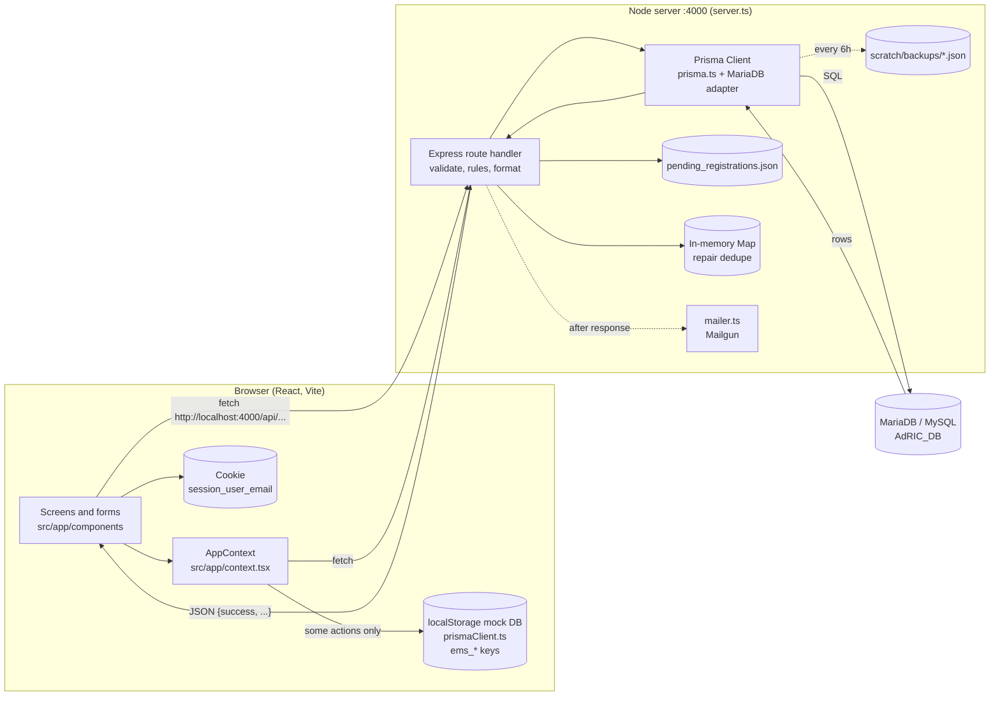
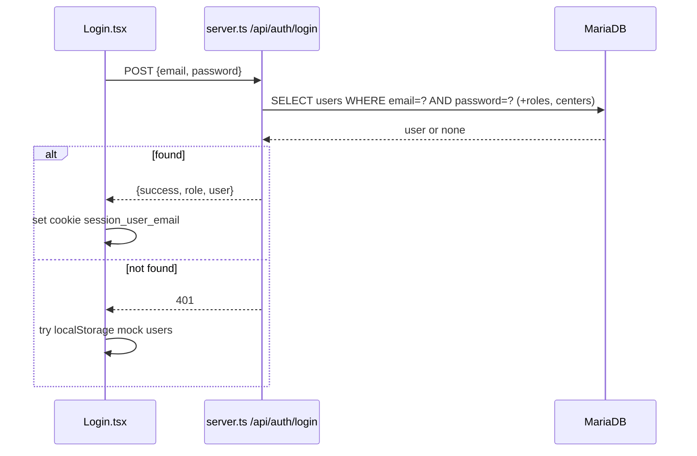
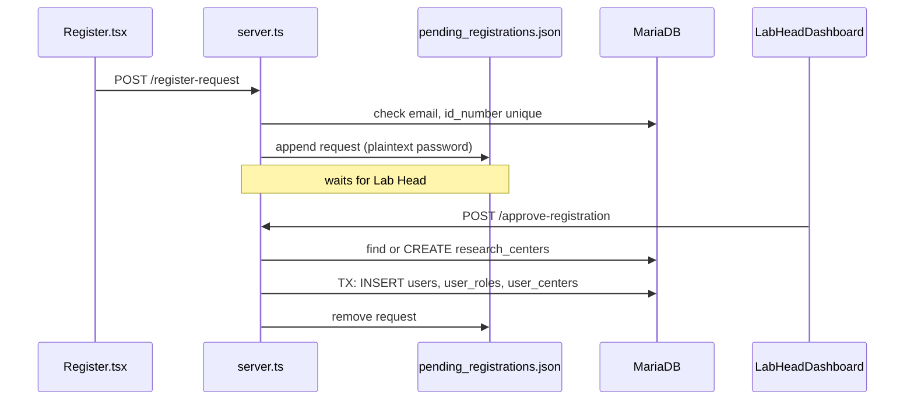
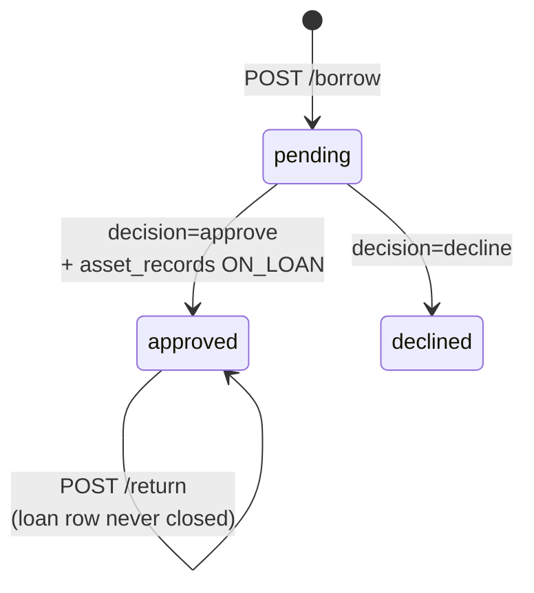
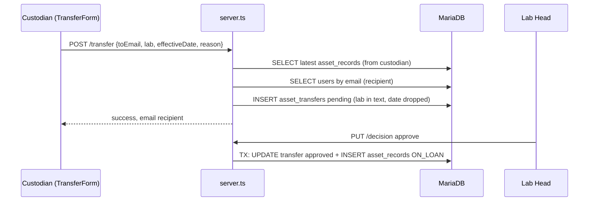
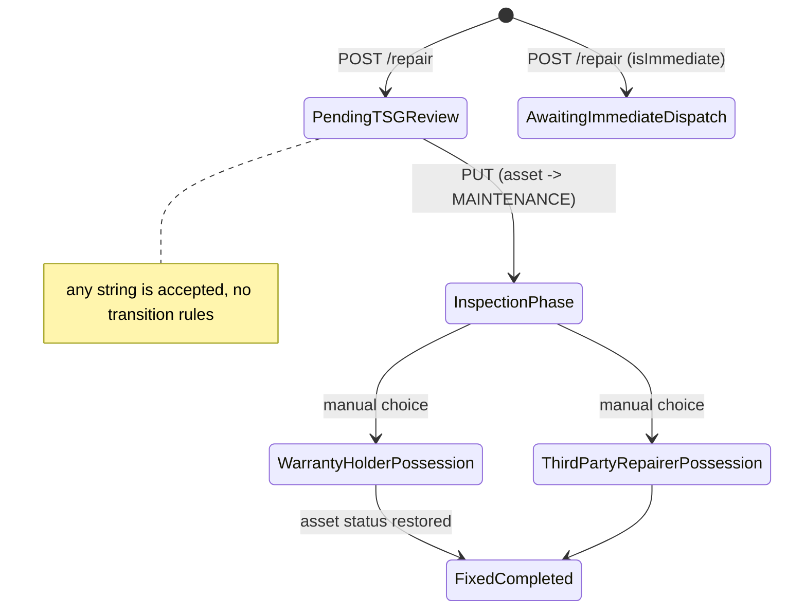
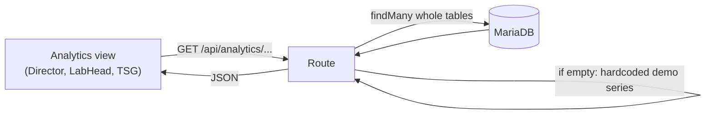

# 01. Codebase Map (Phase 1)

Project: Asset Management System for DLSU CCS AdRIC (CAP-2519-IT)
Branch read: `database-continuation` (same content as `main`). Older pre-defense branches were NOT read.
Date of analysis: 2026-09-17

How to read this document:

- Every major point has a **Technical** version (for developers) and a **Simple** version (plain language).
- File links are relative to this `docs/` folder, for example [../server.ts#L559](../../server.ts#L559).
- Nothing in the application, the schema, or the database was changed. Nothing was run against the database.

---

## Table of contents

1. [Top findings (read this first)](#1-top-findings-read-this-first)
2. [Folder structure](#2-folder-structure)
3. [Where the backend logic lives](#3-where-the-backend-logic-lives)
4. [How the frontend calls the backend](#4-how-the-frontend-calls-the-backend)
5. [Overall request flow (diagram)](#5-overall-request-flow)
6. [Data path for each in-scope process](#6-data-path-for-each-in-scope-process)
7. [Roles and access control](#7-roles-and-access-control)
8. [Current Prisma usage](#8-current-prisma-usage)
9. [Data stored outside the database](#9-data-stored-outside-the-database)
10. [Panel comments: current state](#10-panel-comments-current-state)
11. [Out of scope notes](#11-out-of-scope-notes)
12. [Glossary for beginners](#12-glossary-for-beginners)

---

## 1. Top findings (read this first)

- **Passwords and personal data are committed to git.**
  - **Technical:** `performDatabaseBackup()` ([../server.ts#L4717-L4747](../../server.ts#L4717-L4747)) dumps the full `users` table (email, plaintext `password`, `id_number`, `user_img`) into `scratch/backups/*.json` every 6 hours and on startup. 113 of these files are tracked in git. The latest one holds 25 users, and 0 of 25 passwords are hashed. `pending_registrations.json` also stores a plaintext password.
  - **Simple:** The server makes copies of the user list, including real passwords, and those copies were uploaded to the repository. Anyone who can see the repo can read them. This matters for D2 (Data Privacy Act) and should be handled by the team before anything else. Changing the passwords is advisable; removing the files from the latest commit alone does not remove them from git history or from anyone's clone.
- **The API has no authentication.**
  - **Technical:** No auth middleware exists. `app.use(cors())` allows any origin ([../server.ts#L11](../../server.ts#L11)). Every route, including approvals, deletes, and `GET /api/auth/pending-registrations` (returns passwords), is callable by anyone who can reach port 4000. The frontend "session" is an unsigned cookie holding an email address ([../src/app/context.tsx#L467-L509](../../src/app/context.tsx#L467-L509)).
  - **Simple:** The server does not check who is asking. The website hides buttons based on role, but anyone can talk to the server directly and approve, delete, or read anything.
- **Two data stores exist: the real database and a fake one in the browser.**
  - **Technical:** [../src/app/prismaClient.ts](../../src/app/prismaClient.ts) is a localStorage mock that imitates the Prisma API. Several context actions write only there, for example `updateTransferRequest`, `approveDisposal`, `rejectDisposal`, `finalizeReturn`, `addAsset` ([../src/app/context.tsx#L693-L972](../../src/app/context.tsx#L693-L972)). The Notification Center's approve buttons for transfers and disposals call these local-only functions ([../src/app/components/NotificationCenter.tsx#L739-L790](../../src/app/components/NotificationCenter.tsx#L739-L790)).
  - **Simple:** Some buttons look like they save to the database but only save inside your own browser. The database never hears about it, and other users never see it.
- **No versioned migrations, no triggers, no stored procedures, no seed script.**
  - **Technical:** There is no `prisma/migrations` folder. `package.json` only has `prisma generate` and `prisma db pull`. Schema changes were made with `$executeRawUnsafe("ALTER TABLE ...")` scripts in `scratch/`. The database already has a column (`asset_monetary.is_documented`) that `schema.prisma` does not know about.
  - **Simple:** Database changes were made by hand, with no recorded history. This confirms the panel's comment.
- **Business rules live only in application code and are easy to bypass.**
  - **Technical:** Status values for loans, transfers, disposals, and repairs are free `VARCHAR` columns. The server does not check whether an asset is already on loan, disposed, or in repair before creating a loan or transfer. A return does not close the loan row.
  - **Simple:** The database accepts almost any value. The rules that keep data clean are only in the server code, and several are missing.

---

## 2. Folder structure

- **Technical:**

  | Path | What it is |
  |---|---|
  | `server.ts` | The whole backend: Express API, 62 routes, about 4,760 lines |
  | `prisma.ts` | Creates the Prisma client using the MariaDB driver adapter |
  | `prisma/schema.prisma` | Database schema (15 models, 8 enums). Looks introspected (`db pull`) |
  | `prisma.config.ts` | Prisma CLI config. Points migrations at `prisma/migrations` (folder does not exist) |
  | `mailer.ts` | Sends email through Mailgun (fire-and-forget notifications) |
  | `test-user.ts` | Run by `npm run seed`. Broken: uses fields that no longer exist (`qr_code_hash`, `asset_type`, `center_id`) |
  | `pending_registrations.json` | Pending sign-up requests, stored as a file (not in the database) |
  | `src/main.tsx`, `src/app/App.tsx` | React entry point, React Query and app context providers |
  | `src/app/routes.tsx` | URL routes per role |
  | `src/app/context.tsx` | Global app state and many data actions (mix of real API calls and localStorage) |
  | `src/app/prismaClient.ts` | Fake "Prisma" backed by browser localStorage, with seeded demo users |
  | `src/app/layouts/RootLayout.tsx` | Page shell. Redirects if not logged in or on the wrong role section |
  | `src/app/components/*.tsx` | Screens and forms (dashboards, Loan/Return/Repair/Transfer forms, analytics views) |
  | `src/app/components/ui/` | shadcn UI building blocks (buttons, dialogs). No data logic |
  | `src/app/constants/labs.ts` | One of three different hardcoded lab lists |
  | `src/app/lib/analyticsReasoning.ts` | Text generation for analytics explanations |
  | `scratch/` | One-off scripts (raw SQL `ALTER TABLE`, checks) and `backups/` JSON dumps |
  | `docs/` | Merge notes, reference files, and these phase documents |

- **Simple:** The project is one folder with two halves. `server.ts` is the "kitchen" that talks to the database. `src/` is the "dining room" (the website) that users see. `prisma/` describes the shape of the database tables. `scratch/` is a drawer of leftover test scripts and data copies.

---

## 3. Where the backend logic lives

- **Technical:** All backend logic is in `server.ts`. There are no controllers, services, or middleware files. Each route handler validates input, queries Prisma, applies business rules, and formats the response inline. Emails are sent after the response via `mailer.ts`.
- **Simple:** Every server feature is written directly inside one big file. Each "route" is one door into the server that does one job.

### 3.1 Endpoints grouped by process

Line numbers link to the handler.

**Login and registration**

| Method | Path | Used by frontend? | Line |
|---|---|---|---|
| POST | `/api/auth/login` | Yes, Login.tsx | [3886](../../server.ts#L3886) |
| GET | `/api/auth/me?email=` | Yes, context.tsx, AccountDetailsPage | [3966](../../server.ts#L3966) |
| PUT | `/api/auth/account` | Yes, context.tsx `updateProfile` | [4023](../../server.ts#L4023) |
| POST | `/api/auth/register-request` | Yes, Register.tsx (writes JSON file) | [3722](../../server.ts#L3722) |
| GET | `/api/auth/pending-registrations` | Yes, context.tsx (returns passwords) | [3717](../../server.ts#L3717) |
| POST | `/api/auth/approve-registration` | Yes, LabHeadDashboard | [3769](../../server.ts#L3769) |
| POST | `/api/auth/reject-registration` | Yes, context.tsx | [3954](../../server.ts#L3954) |
| POST | `/api/auth/register` | No (direct self-registration, unused) | [3613](../../server.ts#L3613) |

**Borrowing**

| Method | Path | Used by | Line |
|---|---|---|---|
| POST | `/api/assets/:assetTag/borrow` | LoanForm | [934](../../server.ts#L934) |
| GET | `/api/asset_loans` | LabHeadDashboard, context (side effect: may INSERT a demo loan) | [291](../../server.ts#L291) |
| PUT | `/api/asset_loans/:loanId/decision` | LabHeadDashboard, LabHeadAnalyticsView, NotificationCenter | [986](../../server.ts#L986) |

**Returning**

| Method | Path | Used by | Line |
|---|---|---|---|
| POST | `/api/assets/:assetTag/return` | ReturnForm (TSG/ITS branch only) | [1326](../../server.ts#L1326) |
| GET | `/api/asset_returns` | Not found in frontend | [1416](../../server.ts#L1416) |

**Custodianship transfer**

| Method | Path | Used by | Line |
|---|---|---|---|
| POST | `/api/assets/:assetTag/transfer` | TransferForm | [1454](../../server.ts#L1454) |
| GET | `/api/asset_transfers` | LabHeadDashboard, context | [1529](../../server.ts#L1529) |
| PUT | `/api/asset_transfers/:transferId/decision` | LabHeadDashboard, LabHeadAnalyticsView | [1594](../../server.ts#L1594) |
| PUT | `/api/asset_transfers/:transferId/accept` | Not found in frontend | [4109](../../server.ts#L4109) |
| GET | `/api/assets/:assetTag/custodian-history` | AssetDetailModal | [414](../../server.ts#L414) |

**Repair**

| Method | Path | Used by | Line |
|---|---|---|---|
| POST | `/api/assets/:assetTag/repair` | RepairForm, ReturnForm, context `addRepairRequest` | [1078](../../server.ts#L1078) |
| GET | `/api/asset_repairs` | ITSDashboard, context | [1134](../../server.ts#L1134) |
| PUT | `/api/asset_repairs/:repairId` | ITSDashboard, context (also syncs asset status) | [1198](../../server.ts#L1198) |
| PUT | `/api/asset_repairs/:repairId/status` | TSGAnalyticsView (does NOT sync asset status) | [4690](../../server.ts#L4690) |

**Asset registration, editing, inspection**

| Method | Path | Used by | Line |
|---|---|---|---|
| GET | `/api/assets` | Almost every screen | [56](../../server.ts#L56) |
| POST | `/api/assets` | ITSDashboard intake wizard | [512](../../server.ts#L512) |
| PUT | `/api/assets/:assetTag` | ITSDashboard edit dialog | [609](../../server.ts#L609) |
| POST | `/api/assets/:assetTag/inspection` | ITSDashboard, CustodianPortal | [763](../../server.ts#L763) |
| GET | `/api/asset-reports` | ITSDashboard | [865](../../server.ts#L865) |
| GET | `/api/asset_reports` | context | [380](../../server.ts#L380) |

**Discontinuing and disposal**

| Method | Path | Used by | Line |
|---|---|---|---|
| DELETE | `/api/assets/:assetTag` | ITSDashboard delete dialog (hard delete) | [895](../../server.ts#L895) |
| POST | `/api/assets/:assetTag/disposal` | ITSDashboard DisposalFormDialog | [1720](../../server.ts#L1720) |
| GET | `/api/asset_disposals` | AdRICDirectorDashboard, context | [1787](../../server.ts#L1787) |
| PUT | `/api/asset_disposals/:disposalId/decision` | AdRICDirectorDashboard | [1824](../../server.ts#L1824) |

**Analytics (30 routes, all read-only except one POST that only returns suggestions)**

- Dashboards: `/api/analytics/dashboard` [1910](../../server.ts#L1910), `/director` [4136](../../server.ts#L4136), `/lab-head` [4283](../../server.ts#L4283), `/tsg` [4583](../../server.ts#L4583)
- Utilization and idle time (S6): `/stakeholder/utilization` [2402](../../server.ts#L2402), `/advanced/idle-time` [2606](../../server.ts#L2606), `/advanced/idle-frequency` [2663](../../server.ts#L2663), `/advanced/equipment-calendar` [3524](../../server.ts#L3524), `/advanced/loan-recommender` [2722](../../server.ts#L2722)
- Warranty (S3): `/advanced/warranty-calendar` [3341](../../server.ts#L3341), `/advanced/vendor-reliability` [3371](../../server.ts#L3371)
- Accountability and retention-adjacent (D2): `/delinquencies` [2771](../../server.ts#L2771), `/stakeholder/accountability-bottlenecks` [2819](../../server.ts#L2819), `/stakeholder/project-closure-recall` (POST) [2876](../../server.ts#L2876), `/advanced/stewardship-score/:userId` [3550](../../server.ts#L3550)
- Others: funding-valuation, campus-transfer-flow, grant-readiness-index, compliance, audit-discrepancies, disposal-prescriptions, project-allocation, location-status, health-trends, degradation, degradation-tracker, preventative-schedule, inspection-progress, chain-of-custody, stewardship-guidelines

**Background job**

- `performDatabaseBackup()` every 6 hours and at startup: [../server.ts#L4717-L4760](../../server.ts#L4717-L4760)

---

## 4. How the frontend calls the backend

- **Technical:**
  - No API client module, no axios, no environment variable for the base URL. Every component calls `fetch("http://localhost:4000/api/...")` directly. Four files define a local `API_BASE = "http://localhost:4000"` (LabHeadDashboard, RepairForm, ReturnForm, TransferForm). `vite.config.ts` has no dev proxy.
  - Response convention: `{ success: boolean, <payload> | error }`. HTTP status is 200 on success, 400/404/409/500 on errors.
  - React Query is installed and wrapped around the app ([../src/app/App.tsx](../../src/app/App.tsx)) but data fetching uses plain `fetch` + `useState`. `context.tsx` `syncFromDb()` refetches assets, transfers, reports, loans, disposals, repairs after most actions ([../src/app/context.tsx#L272-L448](../../src/app/context.tsx#L272-L448)).
  - Identity is not sent with requests. Where the server needs "who did this", the frontend sends a display name (`borrower`, `reportedBy`, `returnedBy`, `requestedBy`) and the server looks it up by splitting first and last name ([../server.ts#L955-L960](../../server.ts#L955-L960)). If there is no match it silently uses `DEFAULT_CUSTODIAN_ID = 1` ([../server.ts#L18](../../server.ts#L18)).
- **Simple:** Each screen phones the server at a fixed address. It does not say who is calling; instead it passes a person's name, and the server guesses who that is. If the guess fails, the action is recorded under user #1.

---

## 5. Overall request flow

- **Simple:** The website sends a request to the server. The server checks the request, asks Prisma to read or write the database, then sends back JSON. Some side paths bypass the database: a JSON file for sign-ups, browser storage for some actions, and backup files.

---

## 6. Data path for each in-scope process

Common background for all processes:

- **Technical:** The asset's current state is not a column on `assets`. It is the **newest row in `asset_records`** for that asset (status, location, current_location, current_custodian, condition, remarks). Most write processes append a new `asset_records` row. "Newest" is found with `ORDER BY date_logged DESC` where `date_logged` is `DATETIME(0)` (1-second precision). Only `GET /api/assets` adds a tie-breaker on `asset_record_id` ([../server.ts#L67-L69](../../server.ts#L67-L69)); the write handlers do not (for example [../server.ts#L1024-L1027](../../server.ts#L1024-L1027)), so two records logged in the same second can pick the wrong "latest".
- **Simple:** Think of `asset_records` as a logbook for each item. To know where an item is now, the system reads the last page of its logbook. Each action (loan approved, repair started, returned) writes a new page.

`location` vs `current_location`:

- **Technical:** `location` is the home "Campus + separator + Lab" string set at intake. `current_location` is where the item physically is now (loan or transfer destination, or the fixed string for the TSG Office during repair, [../server.ts#L1196](../../server.ts#L1196)). Both are free text. Lab is also derived from the asset tag prefix (for example `CeLT-0004`) for Lab Head scoping.
- **Simple:** "Home" and "where it is right now" are stored as plain text, not as links to a lab table.

### 6.1 Login

- **Technical:**
  1. UI: [../src/app/components/Login.tsx#L20-L90](../../src/app/components/Login.tsx#L20-L90) checks the email ends with `@dlsu.edu.ph`.
  2. API: `POST /api/auth/login` with `{ email, password }`.
  3. Logic: `prisma.users.findFirst({ where: { email, password }, include: user_roles.roles, user_centers.research_centers })` ([../server.ts#L3894-L3911](../../server.ts#L3894-L3911)). Password is compared as plaintext inside the SQL `WHERE`.
  4. Role mapping picks one app role from DB roles ([../server.ts#L3918-L3928](../../server.ts#L3918-L3928)). Lab affiliation = first `user_centers` row only.
  5. Response: `{ role, user }`. Frontend stores three cookies (`session_user_email`, `session_last_activity`, `session_created`) and routes to the role section.
  6. Fallback: if the API says "invalid", Login.tsx checks the localStorage mock with seeded demo passwords and, if found, still logs in as "Custodian" ([../src/app/components/Login.tsx#L55-L75](../../src/app/components/Login.tsx#L55-L75)).
  7. On page reload, `GET /api/auth/me?email=<cookie>` restores the role without a password ([../src/app/context.tsx#L497-L509](../../src/app/context.tsx#L497-L509)).
  - Tables read: `users`, `user_roles`, `roles`, `user_centers`, `research_centers`. No writes. No login audit.
- **Simple:** The server looks for a user whose email and password both match. If found, it tells the website which dashboard to show. The website remembers only your email in a cookie, and anyone who edits that cookie can become someone else.

### 6.2 User registration

- **Technical:**
  1. UI: [../src/app/components/Register.tsx#L60-L125](../../src/app/components/Register.tsx#L60-L125). `requestedRole` is hardcoded to "Custodian" ([L29](../../src/app/components/Register.tsx#L29)). Lab chosen from `DLSU_LABS` ([../src/app/constants/labs.ts](../../src/app/constants/labs.ts)), a single value.
  2. `POST /api/auth/register-request`: checks email and id_number are not already in `users`, then appends an object (including plaintext password) to an in-memory array and writes it to `pending_registrations.json` ([../server.ts#L3722-L3766](../../server.ts#L3722-L3766)). No database write.
  3. Lab Head approves in LabHeadDashboard, `POST /api/auth/approve-registration` ([../server.ts#L3769-L3883](../../server.ts#L3769-L3883)):
     - Maps requested role text to a DB role by substring.
     - Finds `research_centers` by name, short_code, or code in parentheses. If none, **creates a new research center** outside the transaction, with `location: "MANILA"`.
     - `$transaction`: create `users`, create one `user_roles`, create one `user_centers`.
     - Removes the item from the JSON file.
     - If the request id is not found, it builds a new user from the request body (so any caller can create an account).
  4. Reject: removes from the JSON file only. No record kept.
- **Simple:** Signing up does not touch the database at first. The request waits in a text file. When a Lab Head approves, the server creates the account in the database. If the lab name is not recognized, the server invents a new lab.

### 6.3 Borrowing (loan request, approval, denial)

- **Technical:**
  1. UI: [../src/app/components/LoanForm.tsx#L96-L130](../../src/app/components/LoanForm.tsx#L96-L130). Fields: borrower name (editable free text, prefilled from current user), destination lab (hardcoded list), purpose, due date. After success it also calls `addTransferRequest` which writes a fake transfer into localStorage.
  2. `POST /api/assets/:tag/borrow` ([../server.ts#L934-L983](../../server.ts#L934-L983)):
     - Resolves borrower by splitting the name; falls back to user 1.
     - Encodes the lab into the `purpose` text as `Destination Lab: X\n\n...`.
     - `INSERT asset_loans (status 'pending')`. No check on asset status (can request a loan on an asset that is ON_LOAN, MAINTENANCE, or DISPOSED), no check for other pending loans, no check that due date is in the future.
  3. Lab Head decides: `PUT /api/asset_loans/:id/decision` `{decision: approve|decline}` ([../server.ts#L986-L1062](../../server.ts#L986-L1062)):
     - Reads the loan, rejects if status is not `pending` (check is outside the transaction).
     - `$transaction`: `UPDATE asset_loans.status` to `approved` or `declined`. If approved: read latest `asset_records`, parse destination lab from `purpose`, `INSERT asset_records (status ON_LOAN, current_custodian = borrower, current_location = campus + lab)`.
     - No approver id, no decision timestamp stored.
  4. Read: `GET /api/asset_loans` joins in JavaScript. It **inserts a demo loan with id 9** if no pending loan exists ([../server.ts#L297-L316](../../server.ts#L297-L316)), and renames loan 9's asset to a fixed laptop name in the response.
- **Simple:** A borrow request creates a "pending" loan row. Nothing else changes until a Lab Head approves. On approval, the loan becomes "approved" and a new logbook page says the item is now with the borrower. The server does not stop you from borrowing something already borrowed or thrown away.

### 6.4 Returning

- **Technical:**
  1. UI: [../src/app/components/ReturnForm.tsx#L42-L123](../../src/app/components/ReturnForm.tsx#L42-L123).
     - Custodian branch: saves a "pending return" to localStorage only (`ems_returns`). Optional "flag for repair" posts to `/repair`.
     - TSG/ITS branch: `POST /api/assets/:tag/return` with `{returnedBy, condition, comments}`, then `finalizeReturn` updates localStorage too.
  2. Server ([../server.ts#L1326-L1413](../../server.ts#L1326-L1413)):
     - Validates `condition` against the 5-value list.
     - Resolves `returnedBy` by name (the asset's custodian name, not the TSG staff processing it).
     - `$transaction`: `INSERT asset_returns (reference_number CLR-<base36 time>)` and `INSERT asset_records (status ACTIVE, condition = reported, current_location = home location, current_custodian = 1)`.
     - Does NOT update `asset_loans` (no `returned` status, no `returned_at`), does not check the asset was on loan, does not link the return to the loan.
- **Simple:** Only TSG/ITS can finalize a return in the database. When they do, the item goes back to "active" and is assigned to user #1 as a placeholder. The original loan is never marked finished, so reports that look for "not returned" loans will keep counting it.

### 6.5 Custodianship transfer (D1, S1, S2)

- **Technical:**
  1. UI: [../src/app/components/TransferForm.tsx#L96-L140](../../src/app/components/TransferForm.tsx#L96-L140). Fields: asset tag (disabled), current custodian (disabled, display only), recipient email (typed), destination lab (hardcoded 10-item list), effective date, reason. Pipeline text says "Lab Head Approval" then "TSG Log Verification".
  2. `POST /api/assets/:tag/transfer` ([../server.ts#L1454-L1524](../../server.ts#L1454-L1524)):
     - `from_custodian_id` = latest `asset_records.current_custodian`.
     - Recipient must exist by email (good, no silent fallback).
     - Lab is encoded into `justification` text. `effectiveDate` is sent but **ignored**.
     - `INSERT asset_transfers (status 'pending')`. Emails recipient.
     - No check that the asset is not already in a pending transfer, on loan to someone else, in maintenance, or disposed. No check that recipient differs from current custodian.
  3. Decision `PUT /api/asset_transfers/:id/decision` ([../server.ts#L1594-L1685](../../server.ts#L1594-L1685)): same pattern as loans. On approve inserts `asset_records (status ON_LOAN, current_custodian = to_custodian_id)`. Code comment says the recipient decides, but only Lab Head screens call it.
  4. `PUT /api/asset_transfers/:id/accept` ([../server.ts#L4109-L4129](../../server.ts#L4109-L4129)) sets status `pending_approver`, after which `/decision` refuses ("already been pending_approver"). Not called by the frontend.
  5. Identifying the asset without QR: see D1 in section 10.
- **Simple:** A transfer request records who has the item, who should get it, and why. The chosen date is thrown away and the lab is hidden inside the reason text. When approved, a new logbook page gives the item to the new person.

### 6.6 Repair requests (S3, S4)

- **Technical:**
  1. UI: [../src/app/components/RepairForm.tsx#L106-L150](../../src/app/components/RepairForm.tsx#L106-L150). One free-text textarea. `reportedBy` = asset's custodian name (not the logged-in user). The form POSTs to `/repair`, then calls `addRepairRequest` which **POSTs again** ([../src/app/context.tsx#L642-L657](../../src/app/context.tsx#L642-L657)). The second call is normally blocked by the server's 8-second in-memory duplicate guard ([../server.ts#L1075-L1096](../../server.ts#L1075-L1096)).
  2. `POST /api/assets/:tag/repair` ([../server.ts#L1078-L1131](../../server.ts#L1078-L1131)): `INSERT asset_repairs (progress_status 'Pending TSG Review' or 'Awaiting Immediate Dispatch')`. **No warranty lookup.** Asset status unchanged.
  3. TSG/ITS update `PUT /api/asset_repairs/:id` ([../server.ts#L1198-L1307](../../server.ts#L1198-L1307)):
     - Any string accepted as `progressStatus`.
     - If in `["Inspection Phase", "Warranty Holder Possession", "Third-Party Repairer Possession"]`: append `asset_records MAINTENANCE` at TSG Office (skipped if already MAINTENANCE).
     - If `"Fixed & Completed"`: restore status, custodian, current_location from the newest non-MAINTENANCE record; append `asset_reports`.
     - Other strings (for example `Waiting for Parts`, present in backup data): ticket updates but asset status does not.
     - Whether "Warranty Holder" or "Third-Party" applies is chosen manually in a dropdown ([../src/app/components/ITSDashboard.tsx#L2912-L2918](../../src/app/components/ITSDashboard.tsx#L2912-L2918)).
  4. `PUT /api/asset_repairs/:id/status` ([../server.ts#L4690-L4711](../../server.ts#L4690-L4711)) used by TSGAnalyticsView updates only the ticket, never the asset status. Two endpoints, two different behaviors.
  - No columns for completed_at, technician, cost, vendor, warranty flag, or issue category.
- **Simple:** A repair request is a free-text note. TSG staff move it through stages by picking from a dropdown. The system never checks the warranty date itself; staff must decide manually whether the manufacturer should fix it.

### 6.7 Asset registration (S5)

- **Technical:**
  1. UI: ITSDashboard intake wizard ([../src/app/components/ITSDashboard.tsx#L584-L630](../../src/app/components/ITSDashboard.tsx#L584-L630)). Fields: name, serial (auto-generated `ADRIC-<year>-<hex>` by default), manufacturer, category, funding, acquisition value, procured, warranty, location, lab, image (base64), remarks. No custodian, no project, no bundle or accessory fields. After success it also calls `addAsset` (localStorage).
  2. `POST /api/assets` ([../server.ts#L512-L606](../../server.ts#L512-L606)):
     - Tag = lab prefix + next 4-digit number, computed by reading all tags with that prefix **outside** the transaction (two simultaneous intakes can collide on the unique index).
     - `$transaction`: `INSERT assets`, `INSERT asset_monetary`, `INSERT asset_records (ACTIVE, PERFECT, custodian = data.custodianId or 1)`. The comment mentions `projects` but no project row is written.
  3. Edit `PUT /api/assets/:tag` ([../server.ts#L609-L760](../../server.ts#L609-L760)): **overwrites** the latest `asset_records` row in place (breaks the append-only logbook), and inserts an `asset_reports` row whenever remarks or condition are sent. `acquisition_value` is not updated on edit.
  4. Inspection `POST /api/assets/:tag/inspection` ([../server.ts#L763-L862](../../server.ts#L763-L862)): `$transaction`: `INSERT asset_reports`, then overwrite latest record's condition and remarks.
- **Simple:** Registering an item creates three linked rows at once: the item, its cost, and the first logbook page. Each item is treated as one standalone thing; there is no way to say "this laptop came with a charger and a bag".

### 6.8 Discontinuing an asset

- **Technical:** There is no separate "discontinued" status (the `asset_records_status` enum is ACTIVE, ON_LOAN, MAINTENANCE, DISPOSED). Two paths exist:
  - Hard delete `DELETE /api/assets/:tag` ([../server.ts#L895-L926](../../server.ts#L895-L926)) deletes records, monetary, loans, repairs, transfers, returns, disposals, then the asset. It does **not** delete `asset_reports`, which has an FK to `assets`, so deleting any inspected asset fails with a 500. When it succeeds, all history is destroyed.
  - "Decommission" (the Archive icon in ITSDashboard) opens the disposal flow (6.9).
- **Simple:** "Discontinue" today means either erase the item and its whole history, or send it to disposal. Erasing breaks if the item was ever inspected. Erasing history is usually not acceptable for audited equipment.

### 6.9 Disposal

- **Technical:**
  1. UI: `DisposalFormDialog` ([../src/app/components/ITSDashboard.tsx#L2702-L2740](../../src/app/components/ITSDashboard.tsx#L2702-L2740)). Pathway from a hardcoded list.
  2. `POST /api/assets/:tag/disposal` ([../server.ts#L1720-L1784](../../server.ts#L1720-L1784)): packs pathway, last custodian, and target date into one `disposal_reason` text block. `INSERT asset_disposals (status 'pending')`. Emails ADRIC_DIRECTOR users. No check for an existing pending disposal or an asset on loan.
  3. Director decides `PUT /api/asset_disposals/:id/decision` ([../server.ts#L1824-L1907](../../server.ts#L1824-L1907)): `$transaction`: `UPDATE asset_disposals.status` to `approved` or `rejected`; if approved `INSERT asset_records (DISPOSED, disposal_id)`. Note `current_location` is not set on this record.
  4. `GET /api/assets` parses the text back out with regex ([../server.ts#L152-L157](../../server.ts#L152-L157)).
  5. Separate local-only path: NotificationCenter approve/reject writes to localStorage mock only.
- **Simple:** ITS/TSG file a disposal request, the Director approves it, and a final logbook page marks the item "disposed". The details are saved as one paragraph of text, which the server later re-reads with pattern matching.

### 6.10 Usage time and utilization (S6)

- **Technical:**
  - No usage session table. Time data available: `asset_loans.loaned_on` (request time, not handover time), `due_date` (date only), `asset_records.date_logged`, `asset_returns.returned_on`. Loans and returns are not linked.
  - `/stakeholder/utilization` ranks by `count(loans) + count(transfers)` with no time window ([../server.ts#L2402-L2437](../../server.ts#L2402-L2437)).
  - `/lab-head` utilization % = share of lab assets whose latest record has a `project_id` ([../server.ts#L4395-L4403](../../server.ts#L4395-L4403)). No endpoint writes `project_id`, so this is based on whatever was entered manually.
  - `/advanced/idle-time` and `/idle-frequency` bucket ACTIVE assets by days since last return or last record.
  - `/advanced/equipment-calendar` lists loans as start/end events.
- **Simple:** The system counts how many times an item was borrowed, but not when or for how long it was actually used. It cannot show busy periods such as "every week before finals".

### 6.11 Data retention and deletion for graduating students (D2)

- **Technical:** Nothing implemented server-side. `users` has no status, graduation or expected end date, last login, consent, or deleted/anonymized flags. No endpoint deletes or anonymizes a user. Clearance holds are localStorage only ([../src/app/context.tsx#L266-L269](../../src/app/context.tsx#L266-L269), [L865-L893](../../src/app/context.tsx#L865-L893)). All FKs are `ON DELETE NO ACTION`, so deleting a user with any history would fail. `project-closure-recall` only returns a suggestion text.
- **Simple:** There is no way to mark a student as graduated, and no rule for when their data should be removed. The only "clearance hold" feature lives in one person's browser.

### 6.12 Analytics data retrieval

- **Technical:** Every analytics route loads whole tables with `findMany` (often with `include`) and aggregates in JavaScript. No SQL `GROUP BY`, no views, no raw queries. Several return **hardcoded demo series** when real data is empty, for example [../server.ts#L2078-L2085](../../server.ts#L2078-L2085), [L2097](../../server.ts#L2097), [L2120](../../server.ts#L2120), [L4254](../../server.ts#L4254). `/compliance` reads `asset_monetary.is_documented`, a column missing from `schema.prisma`, so Prisma never returns it and documented counts are always 0 ([../server.ts#L2374-L2381](../../server.ts#L2374-L2381)).
- **Simple:** For each chart, the server downloads full tables and does the math itself. When there is no data, some charts quietly show made-up numbers, which can mislead during a demo or defense.

### 6.13 Predefined options across modules (S7)

- **Technical:** Where lists live today:

  | Concept | Enforced in DB? | Where defined |
  |---|---|---|
  | Asset category | Yes, enum | schema + `VALID_CATEGORIES` [../server.ts#L499](../../server.ts#L499) + ITSDashboard (unknown values silently become DEV_KIT) |
  | Condition | Yes, enum (3 separate enums) | schema + `ASSET_CONDITIONS` [../server.ts#L37](../../server.ts#L37) + label maps in 3 places |
  | Record status | Yes, enum | schema |
  | User type, roles, campus | Yes, enum | schema |
  | Loan / transfer / disposal status | **No**, `VARCHAR(50)` | string literals in server |
  | Repair progress status | **No**, `VARCHAR(100)`, any string accepted | `MAINTENANCE_STATUSES` + ITSDashboard dropdown |
  | Repair issue type | **No**, free text | none |
  | Disposal pathway | **No**, free text inside `disposal_reason` | two different lists: RepairForm [L70-L76](../../src/app/components/RepairForm.tsx#L70-L76) vs ITSDashboard [L2785](../../src/app/components/ITSDashboard.tsx#L2785) |
  | Labs | Table exists (`research_centers`) but forms do not use it | `labs.ts` (11 long names), `LABS` in Loan/TransferForm (10 codes), `LAGUNA_LABS` in server (5 codes) |
  | Funding source | **No**, free text | intake default "DOST" |

- **Simple:** Some choices are locked down by the database (like category). Many others are typed as plain text or come from lists copied in different files that do not agree with each other.

### 6.14 Seed data for the demo (O1)

- **Technical:** `npm run seed` runs `test-user.ts`, which targets fields that no longer exist and will fail. Demo data currently comes from manual entry into the shared remote DB (latest committed backup, 2026-08-05: 25 users, 49 assets, 16 loans, 22 repairs, 15 transfers; no pending loans or transfers). Other "seeding" is accidental: `GET /api/asset_loans` inserts loan 9, analytics return fake series, `prismaClient.ts` seeds demo users into localStorage.
- **Simple:** There is no working "fill the database with demo data" button. The data you have was typed in by hand on the shared server.

---

## 7. Roles and access control

### 7.1 Roles that exist

- **Technical:**
  - Database enum `roles_role_name`: ADMIN, ADRIC_DIRECTOR, ADRIC_SECRETARY, TSG_STAFF, ITS_STAFF, LAB_HEAD, CUSTODIAN ([../prisma/schema.prisma#L259-L267](../../prisma/schema.prisma#L259-L267)). A user can have many roles via `user_roles`.
  - App roles (frontend): ITS, TSG, LabHead, Custodian, AdRICDirector ([../src/app/context.tsx#L30](../../src/app/context.tsx#L30)).
  - Mapping at login and `/me` ([../server.ts#L3918-L3928](../../server.ts#L3918-L3928)), first match wins:

    | DB role | App role |
    |---|---|
    | ADMIN or ADRIC_SECRETARY | ITS |
    | ADRIC_DIRECTOR | AdRICDirector |
    | TSG_STAFF | TSG |
    | LAB_HEAD | LabHead |
    | ITS_STAFF, CUSTODIAN, none | Custodian |

- **Simple:** The database knows 7 job titles; the website knows 5 dashboards. The server translates one into the other. A person with several titles only gets one dashboard.

### 7.2 How pages and routes are protected

- **Technical:**
  - Frontend: `RootLayout` redirects to `/login` if `role` is null and to the role's own section if the URL does not start with its slug ([../src/app/layouts/RootLayout.tsx#L14-L26](../../src/app/layouts/RootLayout.tsx#L14-L26)). Buttons are shown or hidden with `role === ...` checks inside components (for example [../src/app/components/AssetDetailModal.tsx#L339-L500](../../src/app/components/AssetDetailModal.tsx#L339-L500)).
  - Role source: login response, or `GET /api/auth/me?email=<cookie>` on reload. The cookie is plain text.
  - Backend: **no checks at all.** No middleware, no token, no session, no per-route role check, no "is this user the custodian of this asset" check.
- **Simple:** Only the website enforces roles, by hiding pages and buttons. The server trusts everyone.

### 7.3 Frontend vs backend mismatches

- **Technical:**
  - `ITS_STAFF` maps to Custodian, not ITS ([../server.ts#L3920-L3928](../../server.ts#L3920-L3928)).
  - `ADRIC_SECRETARY` gets the ITS dashboard, not a Director or secretary view.
  - Approve-registration maps "ITS" or "ADMIN" text to ADMIN and never assigns ITS_STAFF, ADRIC_SECRETARY, or ADRIC_DIRECTOR ([../server.ts#L3796-L3801](../../server.ts#L3796-L3801)).
  - Transfers: server comment says the recipient approves ([../server.ts#L1447-L1453](../../server.ts#L1447-L1453)); UI only lets Lab Heads call `/decision`; TransferForm pipeline shows "Lab Head Approval"; NotificationCenter shows transfer approve buttons with no role gate (and they are local-only).
  - Loans: LabHeadDashboard decides loans; NotificationCenter also lets ITS and TSG approve loans ([../src/app/components/NotificationCenter.tsx#L730](../../src/app/components/NotificationCenter.tsx#L730)).
  - Lab Head scoping uses the asset tag prefix, not the Lab Head's `user_centers` rows ([../server.ts#L332-L339](../../server.ts#L332-L339)).
  - ITS and TSG share the same `ITSDashboard` and routes.
  - Login fallback to the localStorage mock lets seeded demo credentials log in as Custodian when the API rejects them.
- **Simple:** The website and server disagree on who is allowed to approve some things, and one staff role accidentally gets the student dashboard.

---

## 8. Current Prisma usage

- **Technical:**
  - **Client setup:** `prisma-client-js` generator, `PrismaMariaDb` adapter ([../prisma.ts](../../prisma.ts)), pool of 20. Datasource URL for the CLI comes from `DATABASE_URL` in `prisma.config.ts`; the runtime uses separate `DATABASE_HOST/PORT/USER/PASSWORD/NAME` variables and falls back to **hardcoded connection defaults including a password** in `prisma.ts`. No `.env` file is present in this working copy.
  - **Migrate vs db push:** Neither. The workflow is "change the DB by hand, then `prisma db pull`". Evidence: no `prisma/migrations` folder; scripts `prisma:generate` and `prisma:pull` only; schema has introspection-style names (`map: "fk_records_asset"`, enum names like `asset_records_status`, a column named `Asset_Remarks`); raw DDL scripts in `scratch/` (`add_column.ts` adds `is_documented`, `alter_table.ts`, `update_user_img_column.ts`); a comment references `migration_widen_condition_enum.sql` which is not in the repo ([../server.ts#L1317-L1322](../../server.ts#L1317-L1322)).
  - **Schema drift:** `asset_monetary.is_documented` exists in the DB (per script) but not in `schema.prisma`. `asset_returns_condition` lacks the `@map("MINOR DRIFT")` that the other two condition enums have, so the DB may store different text for the same value.
  - **Relations:** `asset_transfers.from_custodian_id` and `to_custodian_id` have no FK relation to `users`. `asset_records.transfer_id`, `repair_id` are never written; only `disposal_id` is. All FKs are `NoAction`.
  - **Seeding:** none that works (section 6.14).
  - **Transactions:** 11 interactive `$transaction` blocks: asset create [559](../../server.ts#L559), asset edit [646](../../server.ts#L646), inspection [805](../../server.ts#L805), asset delete [908](../../server.ts#L908), loan decision [1013](../../server.ts#L1013), repair update [1221](../../server.ts#L1221), return [1365](../../server.ts#L1365), transfer decision [1622](../../server.ts#L1622), disposal decision [1852](../../server.ts#L1852), register [3635](../../server.ts#L3635), approve registration [3839](../../server.ts#L3839). Gaps: status "is still pending" checks happen before the transaction (double approval race); asset tag sequence computed outside the transaction; `/api/auth/account` does two writes without a transaction; research center creation during approval is outside the transaction.
  - **Raw queries:** none in `server.ts`. Only in `scratch/` scripts (`$executeRawUnsafe`, `$queryRawUnsafe`).
  - **Triggers, stored procedures, views, CHECK constraints:** none defined in the repo. (The live DB was not inspected, per the working rules.)
  - **Query style:** read whole tables, join and filter in JavaScript (for example `GET /api/assets` loads 9 full tables per request).
- **Simple:** Prisma is used as a convenient way to read and write rows, and it does wrap multi-step saves in "all or nothing" transactions. But the database structure was changed by hand, there is no history of those changes, and the schema file is already out of date. No logic runs inside the database itself.

---

## 9. Data stored outside the database

| Where | What | Why it matters |
|---|---|---|
| `pending_registrations.json` (server disk) | Sign-up requests, plaintext passwords | Not transactional with `users`; lost or conflicting if the server moves or runs twice; no audit of rejections; exposed by an open GET; committed to git |
| In-memory `Map` in server | Repair duplicate guard | Lost on restart; hides a real double-POST bug in RepairForm |
| `scratch/backups/*.json` | Full dumps of users (with passwords), assets, loans, repairs, transfers | Personal data in git; not a real backup (no restore path, missing tables) |
| Browser localStorage `dlsu_equipment_ms_db_v2` | Mock DB used by `prismaClient.ts` | Actions that write here never reach MySQL |
| Browser localStorage `ems_returns` | Custodian "pending return" requests | Return requests are invisible to TSG on another computer |
| Browser localStorage `ems_inspections`, `ems_pending_disposals` | Local copies | Can disagree with the DB |
| Browser localStorage `ems_manual_clearance_holds` | Clearance holds (D2 related) | Holds exist only in one browser |
| Cookies | `session_user_email` etc. | Identity is forgeable |
| Text inside columns | Destination lab in `purpose` / `justification`; pathway, last custodian, target date in `disposal_reason` | Cannot be filtered, validated, or joined; parsed back with regex |
| Hardcoded lists in code | Labs (3 versions), disposal pathways (2 versions), repair statuses | Not in DB, drift apart |

- **Technical:** Anything outside MySQL cannot take part in transactions, FKs, triggers, or procedures. Any Phase 3 trigger plan must first move these into tables, or the triggers will not see the events.
- **Simple:** The panel wants the database to do more work. It can only work on information it actually has. Right now, several important pieces of information are kept in files, in browsers, or buried inside paragraphs of text.

---

## 10. Panel comments: current state

Legend: **Supported**, **Partly supported**, **Missing**.

### D1. Manual fallback for QR in Custodianship Transfer: **Partly supported**

- **Technical:**
  - Scan tab has camera scan (jsQR) and "Upload QR Image" ([../src/app/components/CustodianPortal.tsx#L200-L270](../../src/app/components/CustodianPortal.tsx#L200-L270), [L670-L680](../../src/app/components/CustodianPortal.tsx#L670-L680)). Both need a readable QR.
  - A manual path exists indirectly: the My Assets / Available tabs have a search box by name or ID ([../src/app/components/CustodianPortal.tsx#L528](../../src/app/components/CustodianPortal.tsx#L528)) that opens the same asset modal and TransferForm.
  - Missing: a typed asset tag or serial entry on the scan screen, a required reason for bypassing QR, a verifier (Lab Head or TSG) confirmation, and a stored flag on the transfer (for example `identification_method`, `override_reason`, `verified_by`). `asset_transfers` has no such columns ([../prisma/schema.prisma#L190-L201](../../prisma/schema.prisma#L190-L201)).
- **Simple:** You can find an item without scanning by searching for it, but the system does not record that the QR was skipped or why, so there is no accountability trail for the override.

### D2. Data Privacy Act: retention and deletion for graduating students: **Missing**

- **Technical:**
  - No retention fields on `users` ([../prisma/schema.prisma#L141-L158](../../prisma/schema.prisma#L141-L158)), no delete or anonymize endpoint, FKs block deletion.
  - Plaintext passwords: stored ([../server.ts#L3641](../../server.ts#L3641), [L3845](../../server.ts#L3845)), compared in SQL ([L3894-L3898](../../server.ts#L3894-L3898)), stored in JSON ([L3751](../../server.ts#L3751)), served by open GET ([L3717-L3719](../../server.ts#L3717-L3719)), dumped into committed backups ([L4724-L4742](../../server.ts#L4724-L4742)).
  - Unauthenticated `GET /api/auth/me?email=` returns anyone's profile.
  - Clearance holds are localStorage only.
- **Simple:** The document promises a privacy policy, but the system has nothing to enforce it, and it currently exposes passwords.

### S1. Transfer details not available for input: **Partly supported**

- **Technical:**
  - Collected: recipient email, destination lab, effective date, reason ([../src/app/components/TransferForm.tsx#L110-L116](../../src/app/components/TransferForm.tsx#L110-L116)).
  - Saved as proper columns: asset, from, to, justification, status, requested_on ([../prisma/schema.prisma#L190-L201](../../prisma/schema.prisma#L190-L201)).
  - Lost or degraded: effective date is dropped ([../server.ts#L1497-L1505](../../server.ts#L1497-L1505)); destination lab is packed into justification text ([L1493-L1495](../../server.ts#L1493-L1495)).
  - Not collected at all: origin lab, condition at handover, accessories or components handed over, project, approver id, decision time, decision remarks, handover confirmation by recipient. No FK from custodian ids to `users`.
- **Simple:** The form asks for some details, but the server throws away the date and hides the lab in the reason text. Key handover facts (condition, what was included, who approved and when) are not captured.

### S2. Custodian labs populated automatically: **Missing** (schema partly ready)

- **Technical:**
  - `user_centers` already supports many labs per user ([../prisma/schema.prisma#L119-L128](../../prisma/schema.prisma#L119-L128)).
  - But registration saves one lab; account update overwrites the single row ([../server.ts#L4072-L4077](../../server.ts#L4072-L4077)); login returns only the first lab ([L3930](../../server.ts#L3930)).
  - No endpoint lists users or a user's labs. TransferForm destination lab is a hardcoded list ([../src/app/components/TransferForm.tsx#L25](../../src/app/components/TransferForm.tsx#L25)) and does not react to the recipient. LoanForm borrower is editable free text ([../src/app/components/LoanForm.tsx#L193-L197](../../src/app/components/LoanForm.tsx#L193-L197)).
  - `research_centers.short_code` values do not match the frontend lists (for example `CITE4D` vs `CITe4D`; "Bioinformatics Lab" has no code), and unmatched names create new centers.
- **Simple:** The database can hold "this person belongs to these labs", but the forms never ask the database. Users still type or pick lab names from lists written into the code.

### S3. Warranty dates trigger repair routing: **Missing**

- **Technical:** `assets.warranty_expiry` is stored ([../prisma/schema.prisma#L77](../../prisma/schema.prisma#L77)) and shown in warranty-calendar analytics. Repair creation ignores it ([../server.ts#L1115-L1123](../../server.ts#L1115-L1123)). The warranty vs third-party choice is a manual dropdown ([../src/app/components/ITSDashboard.tsx#L2916-L2917](../../src/app/components/ITSDashboard.tsx#L2916-L2917)) with no validation. No vendor or seller data exists (only `manufacturer` text). No trigger.
- **Simple:** The warranty date is saved but nothing uses it when a repair is filed. Staff must remember to check it.

### S4. Predefined repair issue options and recommendations: **Missing**

- **Technical:** RepairForm has one free-text box ([../src/app/components/RepairForm.tsx#L344](../../src/app/components/RepairForm.tsx#L344)); `issue_description` is TEXT. The only rule-like logic is in the Custodian health report, a client-side regex for words like "broken" plus severity pills ([../src/app/components/CustodianPortal.tsx#L285-L290](../../src/app/components/CustodianPortal.tsx#L285-L290)). No issue catalog, symptom categories, or recommendation table.
- **Simple:** People describe problems in their own words, so TSG gets inconsistent descriptions and the system cannot suggest next steps.

### S5. Bundles, lots, and serialized accessories: **Missing**

- **Technical:** `assets` has one `serial_number` and no parent, bundle, lot, or component relation ([../prisma/schema.prisma#L69-L87](../../prisma/schema.prisma#L69-L87)). Intake creates one asset per submit. Accessories only appear as free text in the return comments placeholder ([../src/app/components/ReturnForm.tsx#L283](../../src/app/components/ReturnForm.tsx#L283)).
- **Simple:** The system cannot say "these five items arrived together" or track a charger's serial number with its laptop.

### S6. Time element for high utilization periods: **Missing** (only coarse dates exist)

- **Technical:** See 6.10. Utilization is a lifetime count or a project-assignment ratio. No usage sessions, no checkout or check-in timestamps separate from request time, no link between loan and return, no period grouping (week, term, hour).
- **Simple:** The system can say an item is popular, but not when it is in demand.

### S7. Predefined actions or options in all modules: **Partly supported**

- **Technical:** See the table in 6.13. Enums cover category, condition, record status, role, user type, campus. Statuses for loans, transfers, disposals, and repairs are free `VARCHAR`; repair progress accepts any string through two endpoints; labs and disposal pathways have conflicting hardcoded lists; unknown categories silently become DEV_KIT ([../server.ts#L505-L509](../../server.ts#L505-L509)).
- **Simple:** About half the choices are locked down. The workflow statuses, which matter most for clean records, are not.

### O1. Populate more data for the CAP2 demo: **Partly supported**

- **Technical:** Some real data exists in the shared DB (section 6.14). No reproducible seed: `test-user.ts` is broken, no `prisma db seed` config, no fixtures. Fake analytics fallbacks and the auto-inserted loan 9 mask missing data.
- **Simple:** There is some demo data, but no way to rebuild it on a fresh database, and a few charts show invented numbers.

### Summary table

| Comment | State | Main evidence |
|---|---|---|
| D1 | Partly | Search exists; no manual override record |
| D2 | Missing | No retention fields or deletion; plaintext passwords exposed |
| S1 | Partly | Effective date dropped; lab in text; handover facts not captured |
| S2 | Missing | `user_centers` unused by forms; hardcoded lab lists |
| S3 | Missing | Warranty ignored on repair creation |
| S4 | Missing | Free-text issue only |
| S5 | Missing | No bundle or component model |
| S6 | Missing | Counts only, no time periods |
| S7 | Partly | Enums for some fields; workflow statuses free text |
| O1 | Partly | Manual data only; broken seed script |

---

## 11. Out of scope notes

Brief list of issues seen while reading. Not analyzed further.

- Security: no API authentication; `cors()` open to all origins; forgeable cookie session; hardcoded DB connection fallback (including a password) in `prisma.ts`; open `approve-registration` can create accounts from request body; `express.json` limit 50 MB with base64 images stored in `LONGTEXT` columns.
- Committed personal data: `scratch/backups/` (113 files) and `pending_registrations.json`.
- `RepairForm` double-POSTs every repair request (masked by the 409 guard).
- `DELETE /api/assets/:tag` fails for any asset with inspection reports (missing `asset_reports` delete).
- `PUT /api/assets/:tag` overwrites the latest `asset_records` row instead of appending.
- `/api/analytics/delinquencies` filters loans with status not `returned`, but no code ever sets `returned`, so returned items stay "delinquent" ([../server.ts#L2776-L2779](../../server.ts#L2776-L2779)).
- `/api/auth/account` creates centers with `location: "MANILA_CAMPUS"`, which is not a valid enum value (`MANILA`/`LAGUNA`), so that create always fails silently ([../server.ts#L4067](../../server.ts#L4067)).
- `GET /api/asset_loans` writes to the database (inserts loan 9) and overrides asset names for loan 9 in the response.
- Latest-record lookups lack a tie-breaker on `asset_record_id` in write handlers.
- `@types/react` v19 with React 18 runtime; `docs/phase-0-merge/MERGE_NOTES.md` is outdated (mentions `generated/prisma` output that the current schema no longer uses).
- Email templates interpolate user text into HTML without escaping.

---

## 12. Glossary for beginners

- **API / endpoint / route:** A web address on the server that does one job, like `POST /api/assets/CAR-0001/borrow`.
- **GET / POST / PUT / DELETE:** Read / create / update / remove.
- **Prisma:** A library that lets TypeScript code read and write database rows without writing SQL by hand.
- **Schema (`schema.prisma`):** A description of the tables and columns.
- **Migration:** A saved, numbered file of database changes, so every copy of the database can be upgraded the same way.
- **`db pull`:** Prisma reads the live database and rewrites the schema file to match. The opposite direction of a migration.
- **Transaction:** A group of writes that either all succeed or all get undone.
- **Foreign key (FK):** A rule that a column must point to an existing row in another table.
- **Enum:** A column that only accepts values from a fixed list.
- **Trigger:** SQL that the database runs automatically when a row is inserted, updated, or deleted.
- **Stored procedure:** A named SQL routine stored inside the database that code can call, like a function.
- **View:** A saved query that behaves like a read-only table.
- **localStorage:** Storage inside one browser on one computer. Other users cannot see it.
