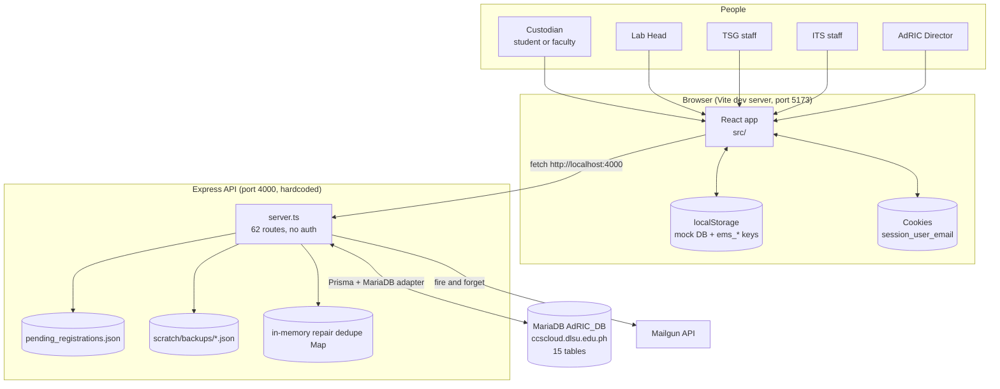
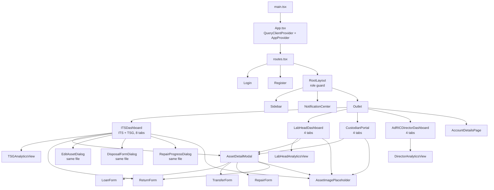
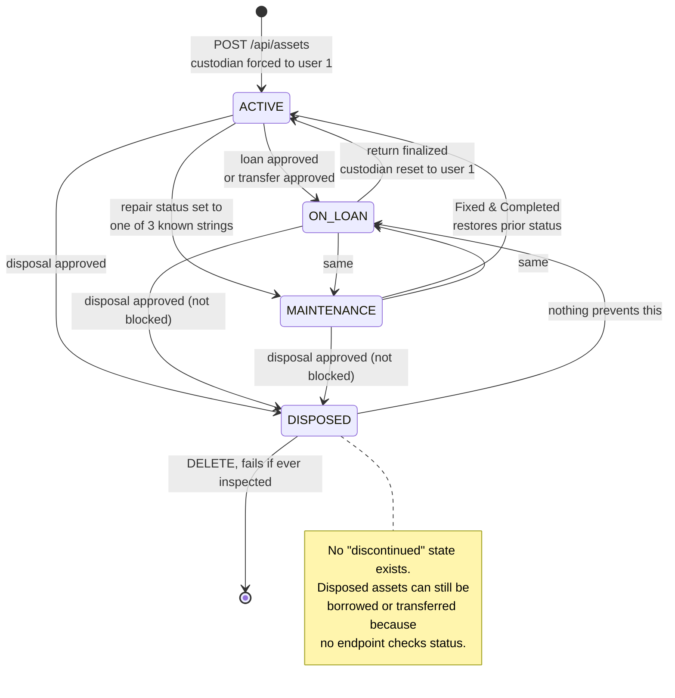
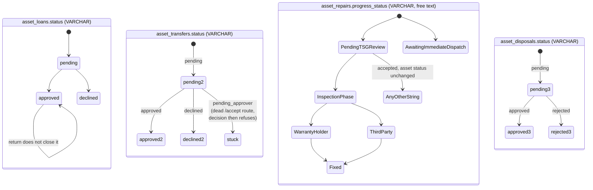

# 01A. System Trace

Project: Asset Management System for DLSU CCS AdRIC (CAP-2519-IT)
Phase: 1B, deep system map
Date: 2026-09-18
Branch read: the current working branch. No older branches were read.

Scope of this document: what the system is made of, and exactly what happens when someone uses it. Problems are named here in passing; the ranked list of problems is in [01B-findings-register.md](01B-findings-register.md).

Method note: every claim below was checked against the code. Where a file was read only in part, that is stated. Where something is uncertain, it is marked **Uncertain** with what would have to be checked.

---

## Table of contents

1. [Corrections to docs/phase-1-codebase-map/01-codebase-map.md](#1-corrections-to-docs01-codebase-mapmd)
2. [System context](#2-system-context)
3. [File inventory](#3-file-inventory)
4. [Component tree](#4-component-tree)
5. [Shared state](#5-shared-state)
6. [Feature catalog](#6-feature-catalog)
7. [Entity lifecycles](#7-entity-lifecycles)
8. [Role and permission matrix](#8-role-and-permission-matrix)
9. [Cross-cutting behavior](#9-cross-cutting-behavior)
10. [Open questions and uncertainties](#10-open-questions-and-uncertainties)

---

## 1. Corrections to docs/phase-1-codebase-map/01-codebase-map.md

The earlier map is broadly accurate. These points are wrong, incomplete, or changed.

| # | Earlier claim | Correction |
|---|---|---|
| C1 | "React Query is installed and wrapped around the app but data fetching uses plain fetch plus useState" | Half wrong. Every analytics view uses React Query: [TSGAnalyticsView.tsx#L57](../../src/app/components/TSGAnalyticsView.tsx#L57), [LabHeadAnalyticsView.tsx#L54](../../src/app/components/LabHeadAnalyticsView.tsx#L54), DirectorAnalyticsView, plus the dead views. The operational screens (ITS, Lab Head, Custodian dashboards, context) use manual fetch plus useState. The codebase has two fetching styles, split by screen type |
| C2 | "One of three different hardcoded lab lists" | There are at least six lab lists, and they disagree. See [section 9.7](#97-the-six-lab-lists) |
| C3 | "Analytics (read-only, 30 routes)" | 30 analytics routes exist: 29 GET and 1 POST ([server.ts#L2876](../../server.ts#L2876)) that only reads and returns suggestions. Also, only 8 of the 30 are reachable from a live screen. 11 are called only by dead components and 11 are called by nothing at all. See [section 6.11](#611-analytics-and-reporting) |
| C4 | File inventory listed `src/app/lib/analyticsReasoning.ts` with a purpose | It is dead code. Nothing imports it |
| C5 | The map did not mention dead components | About 2,670 lines of the frontend are unreachable: AnalyticsDashboard, AnalyticsModule, AssetCatalog, ReportsAnalyticsDashboard, RoleAnalyticsModule, StudentAnalyticsView, analyticsReasoning. See [section 3.4](#34-dead-files) |
| C6 | The map did not mention the type system | There is no `tsconfig.json` anywhere in the repo and no `tsc` step in any script. TypeScript types are never checked, at build time or otherwise. Several real type mismatches are live in the code as a result (see [F-28](#f-28-inspection-queue-and-scheduling-its-and-tsg)) |
| C7 | "server.ts, 63 routes" | 62 route registrations plus 3 `app.use` middleware lines. Corrected in the file already |
| C8 | Map said `GET /api/asset_returns` is unused | Still true, and worth restating with the others: 3 non-analytics endpoints are dead (`POST /api/auth/register`, `GET /api/asset_returns`, `PUT /api/asset_transfers/:id/accept`) |
| C9 | "The database already has a column (`asset_monetary.is_documented`) that `schema.prisma` does not know about" | **Wrong, and worse than described.** The authoritative schema supplied by the team ([../reference/AdRIC_DB_Schema.sql](../reference/AdRIC_DB_Schema.sql)) shows `asset_monetary` with only `asset_monetary_id`, `asset_id`, `funding_source`, and `acquisition_value`. The team confirms the column does not exist in the live database. So [scratch/add_column.ts](../../scratch/add_column.ts) was either never run or run elsewhere, and [server.ts#L2374](../../server.ts#L2374) reads a field that exists nowhere. The effect on the compliance metric is the same; the cause is a phantom column, not a drifted one |
| C10 | The map treated `prisma/schema.prisma` as the description of the database | It is one of two descriptions, and they disagree. The team's SQL file is the real origin schema. See [section 3.5](#35-the-two-schemas-and-where-they-disagree). The most serious disagreement makes two of the five return conditions fail on write |

Everything else in that document held up, including the committed backup files, the absent authentication, the localStorage mock, the missing migrations, and the panel comment ratings.

Also confirmed by the team, closing two Phase 1 uncertainties: **the live database contains no triggers, no stored procedures, and no views.** The panel's comment is factually correct, and Phase 3 starts from zero.

---

## 2. System context

- **Technical:** Three processes matter at runtime: the Vite dev server (port 5173 by default) serving the React bundle, the Express API ([server.ts](../../server.ts)) on a hardcoded port 4000 ([server.ts#L4753](../../server.ts#L4753)), and a remote MariaDB instance reached through the Prisma MariaDB adapter ([prisma.ts](../../prisma.ts)). The browser talks to Express by absolute URL. Express talks to MariaDB and to Mailgun ([mailer.ts](../../mailer.ts)). Express also reads and writes two locations on its own disk: `pending_registrations.json` and `scratch/backups/`.
- **Simple:** Three moving parts: the website in your browser, a server program on your computer, and a database on a DLSU server. The website always calls the server at `localhost:4000`, which means the app only works on the machine running the server.

---

## 3. File inventory

Sizes are line counts. "Imported by" lists first-party importers only (UI primitives and libraries omitted).

### 3.1 Root and backend

| File | Lines | Purpose | Imports | Imported by |
|---|---|---|---|---|
| [server.ts](../../server.ts) | 4,760 | The entire backend. 62 routes, business rules, email triggers, backup timer | express, cors, dotenv, `./mailer`, `./prisma.js`, fs, path | nothing (entry point, run by `npm run server`) |
| [prisma.ts](../../prisma.ts) | 20 | Prisma client singleton over the MariaDB adapter. Hardcoded connection fallbacks including a password | @prisma/adapter-mariadb, @prisma/client, dotenv | server.ts, all scratch scripts, test-user.ts |
| [mailer.ts](../../mailer.ts) | 64 | Mailgun sender plus one HTML template | mailgun.js, form-data | server.ts |
| [prisma/schema.prisma](../../prisma/schema.prisma) | 291 | 15 models, 8 enums. Introspection style, drifted from the live DB | n/a | Prisma CLI, generated client |
| [prisma.config.ts](../../prisma.config.ts) | 14 | Prisma CLI config. Points at `prisma/migrations`, which does not exist | prisma/config, dotenv | Prisma CLI |
| [test-user.ts](../../test-user.ts) | 35 | `npm run seed` target. Broken: writes `qr_code_hash`, `asset_type`, `center_id`, none of which exist on the `assets` model | `./prisma.js` | npm script only |
| [pending_registrations.json](../../pending_registrations.json) | n/a | Live data file: pending sign-ups, holds a plaintext password field | n/a | server.ts at runtime |
| [package.json](../../package.json) | 77 | Scripts and dependencies. No test runner, no lint, no typecheck | n/a | npm |
| [vite.config.ts](../../vite.config.ts) | 36 | Vite config, `@` alias, a `figma:asset/` resolver for files that do not exist in the repo. No dev proxy | n/a | Vite |
| [index.html](../../index.html) | n/a | Vite HTML entry | n/a | Vite |
| **Missing** | n/a | There is no `tsconfig.json`, no `.env.example`, no lint config, no test config | n/a | n/a |

### 3.2 Frontend core

| File | Lines | Purpose | Imports | Imported by |
|---|---|---|---|---|
| [src/main.tsx](../../src/main.tsx) | 6 | React root | App | index.html |
| [src/app/App.tsx](../../src/app/App.tsx) | 23 | QueryClientProvider, AppProvider, RouterProvider | context, routes | main.tsx |
| [src/app/routes.tsx](../../src/app/routes.tsx) | 103 | All routes, grouped by role slug. Role sections are separate URL trees over shared components | 9 screen components | App.tsx |
| [src/app/context.tsx](../../src/app/context.tsx) | 1,195 | Global state and roughly 25 actions. Mixes real API calls, localStorage mock writes, and cookie session handling | prismaClient | every screen |
| [src/app/prismaClient.ts](../../src/app/prismaClient.ts) | 583 | Fake Prisma over localStorage, with seeded demo users and passwords | none | context.tsx, Login.tsx |
| [src/app/layouts/RootLayout.tsx](../../src/app/layouts/RootLayout.tsx) | 118 | Shell, role redirect guard, mobile header, mounts Sidebar and NotificationCenter | context, Sidebar, NotificationCenter | routes.tsx |
| [src/app/constants/labs.ts](../../src/app/constants/labs.ts) | 18 | `DLSU_LABS`, 11 long lab names | none | Register.tsx only |
| [src/styles/*.css](../../src/styles/) | n/a | Tailwind v4, theme, fonts | n/a | main.tsx |

### 3.3 Screens and components (live)

| File | Lines | Purpose | Data source | Imported by |
|---|---|---|---|---|
| [Login.tsx](../../src/app/components/Login.tsx) | 214 | Email and password sign in, cookie session, mock fallback | `POST /api/auth/login`, prismaClient fallback | routes |
| [Register.tsx](../../src/app/components/Register.tsx) | 418 | Sign-up request form with avatar picker | `POST /api/auth/register-request` | routes |
| [RootLayout.tsx](../../src/app/layouts/RootLayout.tsx) | 118 | See above | context | routes |
| [Sidebar.tsx](../../src/app/components/Sidebar.tsx) | 590 | Per-role navigation, preferences panel, logout | context | RootLayout |
| [NotificationCenter.tsx](../../src/app/components/NotificationCenter.tsx) | 929 | Floating bell. Derives notifications from context state, with inline approve buttons | context only (no fetch of its own) | RootLayout |
| [ITSDashboard.tsx](../../src/app/components/ITSDashboard.tsx) | 2,939 | 8 tabs for both ITS and TSG: overview, register, inventory, repairs, inspections, returns, QR tags, health. Contains EditAssetDialog, DisposalFormDialog, RepairProgressDialog | `/api/assets`, `/api/asset_repairs`, `/api/asset-reports`, plus writes | routes |
| [LabHeadDashboard.tsx](../../src/app/components/LabHeadDashboard.tsx) | 1,074 | 4 tabs: custody, inventory, health, approvals. Loan and transfer decisions, registration approvals, audit print | `/api/assets`, `/api/asset_loans`, `/api/asset_transfers` | routes |
| [CustodianPortal.tsx](../../src/app/components/CustodianPortal.tsx) | 896 | 4 tabs: my assets, available, QR scan, inspection report | `/api/assets`, `/api/assets/:tag/inspection` | routes |
| [AdRICDirectorDashboard.tsx](../../src/app/components/AdRICDirectorDashboard.tsx) | 999 | 4 tabs: overview, analytics, approvals and holds, audit generator | `/api/assets`, `/api/asset_disposals` | routes |
| [AccountDetailsPage.tsx](../../src/app/components/AccountDetailsPage.tsx) | 320 | Profile view and edit, avatar presets or upload | `/api/auth/me`, `PUT /api/auth/account` | routes |
| [AssetDetailModal.tsx](../../src/app/components/AssetDetailModal.tsx) | 669 | Asset detail plus the router into the four action forms, custodian history | `/api/assets/:tag/custodian-history` | ITS, LabHead, Custodian screens |
| [LoanForm.tsx](../../src/app/components/LoanForm.tsx) | 266 | Borrow request | `POST .../borrow` | AssetDetailModal |
| [TransferForm.tsx](../../src/app/components/TransferForm.tsx) | 305 | Custodianship transfer request | `POST .../transfer` | AssetDetailModal |
| [RepairForm.tsx](../../src/app/components/RepairForm.tsx) | 384 | Repair request | `POST .../repair` twice, see F-23 | AssetDetailModal |
| [ReturnForm.tsx](../../src/app/components/ReturnForm.tsx) | 432 | Return request (custodian) and finalization (TSG or ITS) | `POST .../return`, `POST .../repair` | AssetDetailModal, ITSDashboard |
| [AssetImagePlaceholder.tsx](../../src/app/components/AssetImagePlaceholder.tsx) | 204 | Category-specific SVG placeholder when an asset has no image | none, pure | 5 screens |
| [DirectorAnalyticsView.tsx](../../src/app/components/DirectorAnalyticsView.tsx) | 1,389 | Director analytics | `/api/analytics/director` | AdRICDirectorDashboard |
| [LabHeadAnalyticsView.tsx](../../src/app/components/LabHeadAnalyticsView.tsx) | 1,328 | Lab Head analytics, plus loan and transfer decision buttons | `/api/analytics/lab-head` (6 calls), idle-time, idle-frequency, loan-recommender | LabHeadDashboard |
| [TSGAnalyticsView.tsx](../../src/app/components/TSGAnalyticsView.tsx) | 762 | TSG and ITS health tab, repair kanban, warranty timeline | `/api/analytics/tsg`, location-status, inspection-progress | ITSDashboard |
| [NotFound.tsx](../../src/app/components/NotFound.tsx) | 99 | 404 page | none | routes |
| [src/app/components/ui/](../../src/app/components/ui/) | 17 files | shadcn primitives. No data logic | none | everywhere |

### 3.4 Dead files

Confirmed unreachable: nothing imports them, and the router does not reference them.

| File | Lines | Notes |
|---|---|---|
| [AnalyticsDashboard.tsx](../../src/app/components/AnalyticsDashboard.tsx) | 498 | Only consumer of `GET /api/analytics/dashboard`, the largest analytics endpoint in the backend |
| [RoleAnalyticsModule.tsx](../../src/app/components/RoleAnalyticsModule.tsx) | 722 | Only consumer of 6 `stakeholder/*` endpoints |
| [ReportsAnalyticsDashboard.tsx](../../src/app/components/ReportsAnalyticsDashboard.tsx) | 523 | Only consumer of delinquencies, health-trends, compliance |
| [AssetCatalog.tsx](../../src/app/components/AssetCatalog.tsx) | 403 | A whole parallel asset browser |
| [StudentAnalyticsView.tsx](../../src/app/components/StudentAnalyticsView.tsx) | 291 | Calls stewardship-score with a hardcoded user id of 1 ([L109](../../src/app/components/StudentAnalyticsView.tsx#L109)) |
| [analyticsReasoning.ts](../../src/app/lib/analyticsReasoning.ts) | 214 | Nothing imports it |
| [AnalyticsModule.tsx](../../src/app/components/AnalyticsModule.tsx) | 21 | Wrapper for two of the above |
| **Total** | **2,672** | About 13 percent of the frontend |

### 3.5 The two schemas and where they disagree

Two files describe the same database and neither is generated from the other any more:

- [prisma/schema.prisma](../../prisma/schema.prisma), which the running code uses through the generated Prisma client.
- [docs/reference/AdRIC_DB_Schema.sql](../reference/AdRIC_DB_Schema.sql), the team's origin schema, which also seeds 14 users, 10 research centers, 3 projects, and 100 assets.

- **Technical:** the disagreements below are ordered by consequence.

| # | Column or object | SQL file | schema.prisma | Consequence |
|---|---|---|---|---|
| 1 | `asset_returns.condition` | `ENUM('PERFECT','OPERATIONAL','MINOR DRIFT','DEGRADED','CRITICAL DEFECT')`, values with spaces | enum `asset_returns_condition` with `MINOR_DRIFT` and `CRITICAL_DEFECT` and **no** `@map` ([schema.prisma#L285-L291](../../prisma/schema.prisma#L285-L291)) | Prisma sends `MINOR_DRIFT`, which is not a member of the column's enum. Finalizing a return in either of those two conditions fails, or silently stores an empty value. The other two condition enums do have `@map` and are fine |
| 2 | `asset_monetary.is_documented` | does not exist | does not exist | `server.ts` reads it anyway ([L2374](../../server.ts#L2374)), so audit compliance is always zero |
| 3 | `users.user_img`, `assets.image_url` | `VARCHAR(500)` | `LongText` | Base64 images do not fit in 500 characters. The live database must already have the ALTERs from [scratch/alter_table.ts](../../scratch/alter_table.ts) and [scratch/update_user_img_column.ts](../../scratch/update_user_img_column.ts) applied, which means the SQL file can no longer recreate a working database |
| 4 | `asset_records.Asset_Remarks` | `VARCHAR(255)` | `@db.Text` | Long remarks are truncated or rejected depending on which description is true |
| 5 | `asset_records.current_location` | `VARCAHR(255)`, a typo that is not a MySQL type | `VarChar(255)` | The SQL file cannot execute as written. See the defects list below |
| 6 | `roles` seed | inserts 6 of the 7 enum values, omitting `ITS_STAFF` | enum lists 7 | An `ITS_STAFF` role cannot be assigned because the row does not exist |

**Defects in the SQL file itself.** It will not run end to end:

- `VARCAHR(255)` on `asset_records.current_location` is a syntax error that stops the script at the third table.
- The `user_roles` insert terminates with `;` after row 13 and then leaves `(14, 3, 6);` as a stray statement, another syntax error. That orphaned row is the only one that would have given the seeded custodian a role.
- `user_roles` row `(3, 4, 6)` assigns user 4, `director@dlsu.edu.ph`, the **CUSTODIAN** role, not `ADRIC_DIRECTOR`. Nobody in the seed holds `ADRIC_DIRECTOR`, so `getRoleEmails("ADRIC_DIRECTOR")` ([server.ts#L1698](../../server.ts#L1698)) returns an empty list and disposal request emails go nowhere, and the Director account logs in to the custodian portal.
- `projects` rows supply integers for `project_id`, a `VARCHAR(255)` column, and omit `master_id`, so `asset_records.project_id` values 1 to 3 may or may not line up with the resulting `master_id` values.
- The seeded `asset_records` place CeLT assets 51 to 55 in `Laguna` and 56 to 60 in `Manila`, while `research_centers` says CeLT is Manila. The server's own campus map ([server.ts#L24](../../server.ts#L24)) is a third opinion: it lists CeLT and CIVI as Laguna, TE3D as Manila, and includes a `MECH` lab that does not exist in the database.
- All 100 seeded assets are assigned to `current_custodian` 1, which matches the hardcoded `DEFAULT_CUSTODIAN_ID`, so the seed data itself carries the "everything belongs to user 1" problem described in [section 9.8](#98-identity-of-the-actor).
- The seeded passwords are the same demo strings hardcoded in the browser mock ([prismaClient.ts#L202-L214](../../src/app/prismaClient.ts#L202-L214)), for example the ITS and TSG accounts. Anyone who reads either file can sign in as any seeded role.

- **Simple:** There are two files that claim to describe the database and they do not match. The SQL one cannot even be run, because of two typing mistakes. It also gives the Director account the wrong job title, so the Director would log in and see the student screen.

### 3.6 Dead or orphaned outside `src/`

Also dead or orphaned outside `src/`:

- `scratch/` (27 scripts plus 113 backup JSON files): one-off utilities, including three that run raw `ALTER TABLE` against the live database.
- [docs/reference/](../reference/) and [docs/reference/schema.fe-design.reference.prisma](../reference/schema.fe-design.reference.prisma): kept deliberately as merge history.
- `figmaAssetResolver` in [vite.config.ts#L7-L17](../../vite.config.ts#L7-L17) resolves `figma:asset/*` to `src/assets/`, a folder that does not exist.

---

## 4. Component tree

- **Technical:** Routing is per role. `RootLayout` is the only guard. Each role's tabs are URL segments that pass an `activeTab` string prop into one large component, which then returns an early `if (activeTab === ...)` branch. ITS and TSG share `ITSDashboard` completely.
- **Simple:** Each role gets its own set of URLs, but several of those URLs load the same giant file, which decides internally which screen to draw.

Who holds what:

| Component | Holds state? | Fetches? | Notes |
|---|---|---|---|
| context.tsx | Yes, the global store | Yes, 6 endpoints in `syncFromDb` | Also writes to localStorage |
| ITSDashboard | Yes, roughly 30 `useState` hooks | Yes, 3 read endpoints plus 4 write paths | Inspection scheduling state is local and ephemeral |
| LabHeadDashboard | Yes | Yes, 3 read plus 2 decision endpoints | Branch filtering is client-side |
| CustodianPortal | Yes | Yes, assets plus inspection POST | Holds camera and QR decoding state |
| AdRICDirectorDashboard | Yes | Yes, assets plus disposals | |
| NotificationCenter | Local UI state only | No | Derives everything from context via one large `useMemo` |
| AssetDetailModal | View switch state | Yes, custodian history | Routes to the four forms |
| Loan/Transfer/Repair/ReturnForm | Yes, form fields | Yes, one POST each | Each also writes to context, sometimes duplicating the POST |
| AnalyticsViews | React Query cache | Yes | Read only, except the Lab Head decision buttons and the TSG kanban |
| AssetImagePlaceholder, NotFound, ui/* | No | No | Pure presentation |

---

## 5. Shared state

### 5.1 React context (`context.tsx`)

- **Technical:** `AppProvider` exposes roughly 40 values. Sources are mixed per field.
- **Simple:** One big shared box of data for the whole website. Some things in the box come from the database, some only from your browser.

| Context value | Where the data really lives | Used by |
|---|---|---|
| `role`, `currentUser` | Login response or `GET /api/auth/me`, keyed by the email cookie | RootLayout, Sidebar, every screen |
| `assets` | `GET /api/assets` if reachable, otherwise the localStorage mock ([context.tsx#L331-L402](../../src/app/context.tsx#L331-L402)) | All dashboards as a fallback |
| `dbTransfers`, `dbReports`, `dbLoans` | Real API | NotificationCenter, dashboards |
| `repairRequests` | Real API (`/api/asset_repairs`) | ITSDashboard, NotificationCenter |
| `pendingDisposals` | Real API, but overwritten by local approve and reject actions | Director dashboard, NotificationCenter |
| `pendingRegistrations` | Real API (the JSON file behind it) | LabHeadDashboard |
| `returns` | **localStorage only** (`ems_returns`) | ITS returns tab, NotificationCenter |
| `inspections` | **localStorage only** (`ems_inspections`) | ITS inspections tab |
| `manualClearanceHolds` | **localStorage only** (`ems_manual_clearance_holds`) | Director, NotificationCenter |
| `inspectionSchedules`, `maintenanceQueue` | **localStorage mock DB** | NotificationCenter reminders |
| `transfers` | **localStorage mock DB**, separate from `dbTransfers` | LabHeadDashboard, NotificationCenter fallback |
| `cycleMode`, `theme`, `sidebarCollapsed` | Cookies | Sidebar, ITS inspections |

### 5.2 Actions that never reach the server

Called from live UI, yet they only touch localStorage:

| Action | Definition | Called from | What the user believes |
|---|---|---|---|
| `updateTransferRequest` | [context.tsx#L916-L936](../../src/app/context.tsx#L916-L936) | NotificationCenter approve and decline buttons ([L757](../../src/app/components/NotificationCenter.tsx#L757), [L766](../../src/app/components/NotificationCenter.tsx#L766)) | The transfer was approved |
| `approveDisposal`, `rejectDisposal` | [L813-L863](../../src/app/context.tsx#L813-L863) | NotificationCenter ([L781](../../src/app/components/NotificationCenter.tsx#L781), [L790](../../src/app/components/NotificationCenter.tsx#L790)) | The disposal was authorized |
| `addReturnRequest` | [L938-L944](../../src/app/context.tsx#L938-L944) | ReturnForm, custodian branch | TSG received the return request |
| `finalizeReturn` | [L946-L972](../../src/app/context.tsx#L946-L972) | ReturnForm, staff branch | Runs after the real POST, so this one is harmless duplication |
| `addAsset`, `updateAsset`, `removeAsset` | [L693-L754](../../src/app/context.tsx#L693-L754) | ITSDashboard, after the real API call | Duplicate bookkeeping, mostly harmless, but it writes a second copy of asset data |
| `addTransferRequest` | [L895-L914](../../src/app/context.tsx#L895-L914) | LoanForm and TransferForm, after the real POST | Creates a fake "transfer" row for a loan as well |
| `addInspectionSchedule`, `resolveMaintenanceItem`, `resetInspectionCycle` | [L1000-L1047](../../src/app/context.tsx#L1000-L1047), [L1107-L1120](../../src/app/context.tsx#L1107-L1120) | Not called by any live screen, see F-28 | n/a |
| `toggleClearanceHold` | [L865-L893](../../src/app/context.tsx#L865-L893) | Director dashboard | A hold was placed on a student |

### 5.3 Browser storage keys

| Key | Written by | Contents |
|---|---|---|
| `dlsu_equipment_ms_db_v2` | prismaClient.ts | Entire mock database, including 11 seeded users with plaintext passwords ([prismaClient.ts#L202-L214](../../src/app/prismaClient.ts#L202-L214)) |
| `ems_returns` | context | Pending return requests |
| `ems_inspections` | context | Inspection reports |
| `ems_pending_disposals` | context | Disposal requests, overwritten by the API copy on sync |
| `ems_manual_clearance_holds` | context | Clearance holds |
| Cookies `session_user_email`, `session_last_activity`, `session_created` | context, Login | The whole session. Unsigned, plain text |

---

## 6. Feature catalog

Legend for the "Reaches DB?" column: **Yes**, **No (browser only)**, **Partly**.

### 6.1 Access and identity

#### F-01 Login

- **Entry point:** [Login.tsx#L20](../../src/app/components/Login.tsx#L20), form at [L112](../../src/app/components/Login.tsx#L112).
- **Inputs:** email, password.
- **Client validation:** non-empty, and the email must end with `@dlsu.edu.ph` ([L28](../../src/app/components/Login.tsx#L28)).
- **API:** `POST /api/auth/login`.
- **Server:** [server.ts#L3886](../../server.ts#L3886). Looks up `users` with `email` and plaintext `password` both in the WHERE clause ([L3894-L3898](../../server.ts#L3894-L3898)), includes roles and centers, then maps DB roles to one app role ([L3918-L3928](../../server.ts#L3918-L3928)).
- **Writes:** none. No login audit row, no failed attempt counter, no lockout.
- **Response handling:** sets three cookies, waits 1 second on a `setTimeout`, then navigates ([L74-L84](../../src/app/components/Login.tsx#L74-L84)).
- **Fallback:** if the API rejects the credentials, the component retries against the localStorage mock and, if a mock user matches, logs the person in as Custodian ([L55-L73](../../src/app/components/Login.tsx#L55-L73)).
- **Tables read:** `users`, `user_roles`, `roles`, `user_centers`, `research_centers`.
- **Silently dropped or defaulted:** every role after the first match; all labs after the first (`user_centers[0]`, [L3930](../../server.ts#L3930)); lab defaults to the string `CITe4D` when the user has no center.
- **Reaches DB?** Yes.

#### F-02 Session restore and expiry

- **Entry point:** [context.tsx#L466-L543](../../src/app/context.tsx#L466-L543), runs once on mount.
- **Behavior:** reads the three cookies. Logs out after 24 hours of inactivity or 30 days of age, using `alert()`. Otherwise calls `GET /api/auth/me?email=<cookie>` and restores role and profile with no password check.
- **Reaches DB?** Yes, read only.
- **Note:** the role is whatever the server reports for that email, so editing the cookie is a complete role change. See 01B.

#### F-03 Logout

- **Entry point:** Sidebar logout button, `onLogout` passed from [RootLayout.tsx#L84](../../src/app/layouts/RootLayout.tsx#L84) calling `setRole(null)` ([context.tsx#L550-L556](../../src/app/context.tsx#L550-L556)).
- **Behavior:** erases the three cookies and clears `currentUser`. Nothing is invalidated server-side because nothing exists server-side.
- **Reaches DB?** No.

#### F-04 Registration request

- **Entry point:** [Register.tsx#L60](../../src/app/components/Register.tsx#L60), fields at [L280-L380](../../src/app/components/Register.tsx#L280-L380).
- **Inputs:** first and last name, DLSU email, 8-digit ID, user type (Student or Faculty), lab from `DLSU_LABS`, password twice, optional avatar (preset URL or uploaded image as base64).
- **Client validation:** email domain, exactly 8 digits, password at least 6 characters, passwords match.
- **API:** `POST /api/auth/register-request`.
- **Server:** [server.ts#L3722](../../server.ts#L3722). Checks email and ID number are not already in `users`, then **appends to a JSON file** with the password in clear text ([L3742-L3758](../../server.ts#L3742-L3758)).
- **Writes:** `pending_registrations.json` only.
- **Silently dropped or defaulted:** `requestedRole` is hardcoded to "Custodian" in the UI ([Register.tsx#L29](../../src/app/components/Register.tsx#L29)), so the role picker the server supports is not exposed; password defaults to a literal fallback string if missing; the request id is `REG-` plus a 6-digit random number, with no collision check.
- **Reaches DB?** No. This is the single most surprising fact in the codebase for a newcomer: registering does not create anything in the database.

#### F-05 Approve registration

- **Entry point:** [LabHeadDashboard.tsx#L716](../../src/app/components/LabHeadDashboard.tsx#L716), approvals tab.
- **Client filter:** only requests whose `labAffiliation` fuzzily matches the Lab Head's own lab ([L470-L496](../../src/app/components/LabHeadDashboard.tsx#L470-L496)). Server-side, no such filter exists.
- **API:** `POST /api/auth/approve-registration`, body is the whole request object ([context.tsx#L1066-L1091](../../src/app/context.tsx#L1066-L1091)).
- **Server:** [server.ts#L3769](../../server.ts#L3769).
  1. If the id is not in the in-memory list, it rebuilds the request from the request body, so any caller can invent an account ([L3774-L3789](../../server.ts#L3774-L3789)).
  2. Maps the requested role text to a DB role by substring ([L3796-L3801](../../server.ts#L3796-L3801)).
  3. Finds a `research_centers` row by name, short code, or parenthesised code, and **creates a new center outside the transaction** if there is no match, always with `location: "MANILA"` ([L3824-L3836](../../server.ts#L3824-L3836)).
  4. `$transaction`: insert `users` (plaintext password), one `user_roles`, one `user_centers`.
  5. Removes the entry from the JSON file.
- **Tables written:** `users`, `user_roles`, `user_centers`, sometimes `research_centers`.
- **Silently dropped or defaulted:** password falls back to a literal string; user type defaults to STUDENT; role falls back to CUSTODIAN; a Laguna lab is recorded as Manila.
- **Reaches DB?** Yes.

#### F-06 Decline registration

- **Entry point:** [LabHeadDashboard.tsx#L728](../../src/app/components/LabHeadDashboard.tsx#L728).
- **Server:** [server.ts#L3954](../../server.ts#L3954) filters the entry out of the JSON file. No record of the rejection, no reason captured, no notification to the applicant.
- **Reaches DB?** No.

#### F-07 and F-08 View and edit account

- **Entry point:** [AccountDetailsPage.tsx](../../src/app/components/AccountDetailsPage.tsx), reached from the sidebar avatar or `/<role>/account`.
- **Reads:** `GET /api/auth/me?email=` on mount ([L32-L51](../../src/app/components/AccountDetailsPage.tsx#L32-L51)).
- **Editable:** first name, last name, avatar (6 Unsplash presets or an uploaded file read as a base64 data URL).
- **Read only in the UI:** email, role, ID number, lab affiliation, with a "Security Lockout" notice.
- **API:** `PUT /api/auth/account` through `updateProfile` ([context.tsx#L583-L630](../../src/app/context.tsx#L583-L630)).
- **Server:** [server.ts#L4023](../../server.ts#L4023). Three-step case-insensitive user lookup, `users.update`, then optional center reassignment. **Not wrapped in a transaction.** The create path uses `location: "MANILA_CAMPUS"` ([L4067](../../server.ts#L4067)), which is not a valid enum value, so that create always throws and is swallowed by an empty catch.
- **Silently dropped:** the UI shows lab affiliation as locked, but `updateProfile` still sends it and the server will move the user's `user_centers` row if the short code matches. The lock is cosmetic.
- **Avatar storage:** the base64 image goes into `users.user_img` (LONGTEXT) and travels in every `/api/assets` style payload that includes users.
- **Reaches DB?** Yes.

### 6.2 Asset registration and inventory

#### F-09 Browse inventory

- **Entry points:** ITS and TSG inventory tab ([ITSDashboard.tsx#L1019](../../src/app/components/ITSDashboard.tsx#L1019)), Lab Head branch inventory ([LabHeadDashboard.tsx#L759](../../src/app/components/LabHeadDashboard.tsx#L759)), Custodian available equipment ([CustodianPortal.tsx](../../src/app/components/CustodianPortal.tsx)), Director overview.
- **API:** `GET /api/assets` ([server.ts#L56](../../server.ts#L56)).
- **Server behavior:** loads **9 entire tables** with `Promise.all`, then joins them in JavaScript to produce one large array, including per-asset arrays of records, transfers, and reports ([L64-L282](../../server.ts#L64-L282)). Every asset image (base64) is included in every response.
- **Client filtering:** search, funding, location, plus the disposed and active sub-tab. Lab Head filters by the fuzzy `matchesBranch` helper ([LabHeadDashboard.tsx#L470](../../src/app/components/LabHeadDashboard.tsx#L470)). Custodian "My Assets" filters by `a.custodian === currentUserName`, a display-name string comparison ([CustodianPortal.tsx#L115](../../src/app/components/CustodianPortal.tsx#L115)).
- **Derived, not stored:** `status` (from the newest record), `daysLeft` (from the newest approved loan), `condition` as a number 35 to 100 mapped from the condition enum ([server.ts#L171-L177](../../server.ts#L171-L177)), disposal details parsed out of free text with regex ([L152-L157](../../server.ts#L152-L157)).
- **Reaches DB?** Yes, read only.

#### F-10 Register an asset

- **Entry point:** ITS and TSG register tab, wizard at [ITSDashboard.tsx#L840](../../src/app/components/ITSDashboard.tsx#L840), submit at [L583](../../src/app/components/ITSDashboard.tsx#L583).
- **Inputs:** name, serial (auto-filled `ADRIC-<year>-<random hex>`, editable), manufacturer, category (20-value list), funding, acquisition value, procurement date, warranty date, campus, lab, image, remarks.
- **Client validation:** minimal. Step gating only.
- **API:** `POST /api/assets` with the raw form object.
- **Server:** [server.ts#L512](../../server.ts#L512).
  - Requires `name` and `category`.
  - Validates the image is a data URL or has an image extension.
  - Generates the asset tag by reading every existing tag with that lab prefix and adding one, **outside** the transaction ([L534-L554](../../server.ts#L534-L554)).
  - `$transaction`: insert `assets`, `asset_monetary`, `asset_records` (ACTIVE, PERFECT).
- **Silently dropped or defaulted:** custodian is never collected, so every asset is logged under `DEFAULT_CUSTODIAN_ID = 1` ([L18](../../server.ts#L18), [L592](../../server.ts#L592)); an unrecognised category silently becomes `DEV_KIT` ([L505-L509](../../server.ts#L505-L509)); no project is ever attached even though the comment says otherwise.
- **After success:** the component also calls `addAsset`, writing a second copy into the localStorage mock.
- **Reaches DB?** Yes.

#### F-11 Edit an asset

- **Entry point:** `EditAssetDialog` ([ITSDashboard.tsx#L2488](../../src/app/components/ITSDashboard.tsx#L2488)), save at [L2509](../../src/app/components/ITSDashboard.tsx#L2509).
- **API:** `PUT /api/assets/:assetTag`.
- **Server:** [server.ts#L609](../../server.ts#L609). Builds a partial update, resolves a custodian by splitting a display name, then **overwrites the newest `asset_records` row in place** rather than appending ([L697-L701](../../server.ts#L697-L701)), and inserts an `asset_reports` row whenever a condition or remarks are present ([L721-L729](../../server.ts#L721-L729)).
- **Silently dropped:** `acquisition_value` is never updated on an existing monetary row ([L667-L675](../../server.ts#L667-L675)); an unmatched custodian name leaves the previous custodian in place with no warning.
- **Reaches DB?** Yes.

#### F-12 Delete an asset

- **Entry point:** trash icon on the gallery card, confirm at [ITSDashboard.tsx#L510](../../src/app/components/ITSDashboard.tsx#L510).
- **API:** `DELETE /api/assets/:assetTag`.
- **Server:** [server.ts#L895](../../server.ts#L895). Deletes 7 child tables then the asset, inside a transaction, but **omits `asset_reports`**, which also has a foreign key to `assets` ([L910-L917](../../server.ts#L910-L917)).
- **Consequence:** any asset that has ever been inspected cannot be deleted; the request fails with a 500 and a foreign key message. Any asset that has not been inspected is erased along with its entire custody history.
- **Reaches DB?** Yes.

#### F-13 Asset detail and custodian history

- **Entry point:** [AssetDetailModal.tsx](../../src/app/components/AssetDetailModal.tsx), opened from any inventory card.
- **API:** `GET /api/assets/:assetTag/custodian-history` ([server.ts#L414](../../server.ts#L414)) on open.
- **Server:** returns every `asset_records` row oldest to newest with the custodian's name, email, and ID number. If there are no records it invents a placeholder entry with the email `custodian@dlsu.edu.ph` ([L472-L484](../../server.ts#L472-L484)).
- **Note:** the history endpoint exposes custodian email and ID number to any caller with no authentication.
- **Reaches DB?** Yes, read only.

#### F-14 QR tag generation and printing

- **Entry point:** ITS and TSG QR tags tab ([ITSDashboard.tsx#L2182](../../src/app/components/ITSDashboard.tsx#L2182)).
- **Behavior:** select assets, preview `QRCodeSVG` tags encoding `https://adric.dlsu.edu.ph/assets/<tag>` ([L2362](../../src/app/components/ITSDashboard.tsx#L2362)), then print by opening a new window and writing an HTML document built by string concatenation ([L2185-L2322](../../src/app/components/ITSDashboard.tsx#L2185-L2322)).
- **Notes:** the encoded domain does not exist; asset names are interpolated into the print HTML without escaping; nothing is recorded about which tags were printed or when.
- **Reaches DB?** No.

#### F-15 QR scan lookup

- **Entry point:** Custodian scan tab ([CustodianPortal.tsx#L133](../../src/app/components/CustodianPortal.tsx#L133) and [L200](../../src/app/components/CustodianPortal.tsx#L200)).
- **Behavior:** live camera via `getUserMedia` plus `jsQR` frame decoding, or an uploaded image decoded the same way. The decoded text is split on `/` and the last segment is treated as the tag. Matching is done first against loaded assets, then against a fresh `GET /api/assets`, comparing tag, serial, or a substring of the name.
- **Failure path:** an `alert()` saying the tag was not found.
- **Manual fallback (D1):** there is no typed tag entry on this screen. The only manual route is the search box on other tabs ([L528](../../src/app/components/CustodianPortal.tsx#L528)). Nothing records that a scan was bypassed.
- **Reaches DB?** Yes, read only.

### 6.3 Borrowing

#### F-16 Loan request

- **Entry point:** [LoanForm.tsx#L96](../../src/app/components/LoanForm.tsx#L96), opened from AssetDetailModal for Custodians only ([AssetDetailModal.tsx#L392](../../src/app/components/AssetDetailModal.tsx#L392)).
- **Inputs:** borrower name (prefilled from the session but fully editable), destination lab (10-item hardcoded list), purpose, due date.
- **Client validation:** all four fields non-empty. The due date has no minimum.
- **API:** `POST /api/assets/:tag/borrow`.
- **Server:** [server.ts#L934](../../server.ts#L934). Resolves the borrower by splitting the typed name into first and rest, falling back to user 1 ([L955-L960](../../server.ts#L955-L960)). Prepends `Destination Lab: X` into the `purpose` text. Inserts `asset_loans` with status `pending`.
- **Rules that are missing:** no check that the asset is available, not disposed, not already on loan, not in maintenance; no check for an existing pending request; no check that the due date is in the future; no maximum loan length.
- **After success:** the form also calls `addTransferRequest`, creating a fake transfer row in localStorage ([LoanForm.tsx#L113](../../src/app/components/LoanForm.tsx#L113)).
- **Reaches DB?** Yes.

#### F-17 Loan decision

- **Entry points:** Lab Head custody tab ([LabHeadDashboard.tsx#L246](../../src/app/components/LabHeadDashboard.tsx#L246)), Lab Head analytics view ([LabHeadAnalyticsView.tsx#L81](../../src/app/components/LabHeadAnalyticsView.tsx#L81)), and the NotificationCenter for Lab Head, ITS, and TSG ([NotificationCenter.tsx#L730-L739](../../src/app/components/NotificationCenter.tsx#L730-L739)).
- **API:** `PUT /api/asset_loans/:loanId/decision` with `{ decision: "approve" | "decline" }`.
- **Server:** [server.ts#L986](../../server.ts#L986). Rejects unless the current status is exactly `pending`, then in a transaction updates the loan and, on approval, appends `asset_records` with status ON_LOAN, the borrower as custodian, and a `current_location` parsed back out of the purpose text.
- **Not recorded:** who approved, when, or why. There is no approver column on `asset_loans`.
- **Race:** the pending check happens before the transaction opens, so two simultaneous approvals can both pass.
- **Reaches DB?** Yes.

### 6.4 Returning

#### F-21 Return request (custodian)

- **Entry point:** [ReturnForm.tsx#L54](../../src/app/components/ReturnForm.tsx#L54), custodian branch.
- **Behavior:** writes a `ReturnRequest` into context, which persists to `localStorage.ems_returns`. Optionally posts a repair request if "flag for repair" is ticked ([L66-L86](../../src/app/components/ReturnForm.tsx#L66-L86)).
- **Consequence:** the ITS "Pending Returns Ledger" ([ITSDashboard.tsx#L2097](../../src/app/components/ITSDashboard.tsx#L2097)) reads the same localStorage array, so a request made on the custodian's laptop is invisible on the TSG machine.
- **Reaches DB?** No, except the optional repair ticket.

#### F-22 Return finalization (TSG or ITS)

- **Entry point:** same form, staff branch, or the returns tab dialog.
- **Inputs:** return date (collected, never sent), condition (5-value list), inspection comments, clearance toggle (local only).
- **API:** `POST /api/assets/:tag/return`.
- **Server:** [server.ts#L1326](../../server.ts#L1326). Validates the condition against the 5 allowed values, resolves `returnedBy` by name, then in one transaction inserts `asset_returns` with a generated reference number and appends `asset_records` with status ACTIVE, the reported condition, and `current_custodian` reset to 1.
- **Not done:** the matching `asset_loans` row is never closed. There is no `returned` status and no link between a return and a loan. `/api/analytics/delinquencies` filters on `status not in ("returned", "RETURNED")` ([L2776-L2779](../../server.ts#L2776-L2779)), a value nothing ever writes, so returned assets stay delinquent forever.
- **Reaches DB?** Yes.

### 6.5 Custodianship transfer

#### F-18 Transfer request

- **Entry point:** [TransferForm.tsx#L104](../../src/app/components/TransferForm.tsx#L104), Custodian only.
- **Inputs:** recipient email (typed), destination lab (hardcoded list), effective date, reason. Asset tag and current custodian are disabled display fields.
- **Client validation:** email regex, all fields present.
- **API:** `POST /api/assets/:tag/transfer`.
- **Server:** [server.ts#L1454](../../server.ts#L1454). Reads the current custodian from the newest record, requires the recipient email to resolve to a real user (the only place in the codebase that refuses to guess), folds the lab into the `justification` text, inserts `asset_transfers` with status `pending`, then emails the recipient.
- **Silently dropped:** `effectiveDate` is sent by the form and never stored.
- **Rules that are missing:** no check for an existing pending transfer, an asset on loan, in maintenance, or disposed; no check that the recipient is not the current custodian; no check that the recipient belongs to the destination lab.
- **Reaches DB?** Yes.

#### F-19 Transfer decision

- **Entry points:** Lab Head custody tab ([LabHeadDashboard.tsx#L318](../../src/app/components/LabHeadDashboard.tsx#L318)) and Lab Head analytics ([LabHeadAnalyticsView.tsx#L100](../../src/app/components/LabHeadAnalyticsView.tsx#L100)). The NotificationCenter's transfer buttons do **not** call this endpoint.
- **API:** `PUT /api/asset_transfers/:transferId/decision`.
- **Server:** [server.ts#L1594](../../server.ts#L1594). Same shape as the loan decision. On approval appends `asset_records` with status **ON_LOAN** under the new custodian, then emails the original custodian.
- **Design contradiction:** the server comment says the recipient decides ([L1447-L1453](../../server.ts#L1447-L1453)); the UI gives the decision to the Lab Head; the form's own pipeline graphic shows a third step, "TSG Log Verification", that does not exist anywhere.
- **Reaches DB?** Yes.

#### F-20 Transfer accept (dead endpoint)

- **Server:** [server.ts#L4109](../../server.ts#L4109) sets the status to `pending_approver` and appends remarks to the justification text.
- **Status:** no caller in the frontend. If it were called, the transfer would be permanently stuck, because `/decision` only accepts a status of exactly `pending` ([L1614](../../server.ts#L1614)).

### 6.6 Repairs and maintenance

#### F-23 Repair request

- **Entry point:** [RepairForm.tsx#L106](../../src/app/components/RepairForm.tsx#L106), Custodian only.
- **Inputs:** one free-text justification. The form also shows resolution fields (date completed, repair cost, disposal pathway, decommission date) that are never sent anywhere ([L235-L280](../../src/app/components/RepairForm.tsx#L235-L280)).
- **API:** `POST /api/assets/:tag/repair`, then `addRepairRequest` posts the **same request a second time** ([RepairForm.tsx#L116](../../src/app/components/RepairForm.tsx#L116) then [L135](../../src/app/components/RepairForm.tsx#L135) into [context.tsx#L642](../../src/app/context.tsx#L642)).
- **Server:** [server.ts#L1078](../../server.ts#L1078). An in-memory map blocks an identical repeat within 8 seconds with a 409 ([L1089-L1096](../../server.ts#L1089-L1096)), which is what normally absorbs the second POST. Inserts `asset_repairs` with `progress_status` "Pending TSG Review" or "Awaiting Immediate Dispatch".
- **Silently dropped or wrong:** `reportedBy` is the asset's **custodian**, not the logged-in reporter; the forwarding target (TSG, ITS, or Both) picked in the UI is never sent; no warranty check happens (panel comment S3); the asset's status does not change.
- **Reaches DB?** Yes.

#### F-24 Flag for immediate maintenance (TSG or ITS)

- **Entry point:** [AssetDetailModal.tsx#L121](../../src/app/components/AssetDetailModal.tsx#L121), the maintenance button shown to TSG and ITS.
- **Behavior:** calls `addRepairRequest` once, so exactly one POST reaches `/repair`. The description is generated text, the priority is "High", and `acknowledged: true` is set locally but has no server meaning.
- **Reaches DB?** Yes.

#### F-25 Repair acknowledge and progress

- **Entry point:** ITS and TSG repairs tab, `RepairProgressDialog` ([ITSDashboard.tsx#L2811](../../src/app/components/ITSDashboard.tsx#L2811)), status choices at [L2912-L2918](../../src/app/components/ITSDashboard.tsx#L2912-L2918).
- **API:** `PUT /api/asset_repairs/:repairId` with `{ progressStatus, assetCondition, assetRemarks }`.
- **Server:** [server.ts#L1198](../../server.ts#L1198).
  - Accepts **any** string as the status.
  - Three known strings move the asset into MAINTENANCE at the fixed location "Manila, TSG Office" ([L1193-L1196](../../server.ts#L1193-L1196)).
  - "Fixed & Completed" restores the status, custodian, and location from the newest non-MAINTENANCE record and writes an `asset_reports` row.
  - Any other string updates the ticket only. The live database already contains "Waiting for Parts", which is in this category.
- **Warranty routing (S3):** the choice between "Warranty Holder Possession" and "Third-Party Repairer Possession" is a manual dropdown. `assets.warranty_expiry` is never consulted.
- **Reaches DB?** Yes.

#### F-26 Repair kanban (TSG health tab)

- **Entry point:** [TSGAnalyticsView.tsx#L77](../../src/app/components/TSGAnalyticsView.tsx#L77).
- **API:** `PUT /api/asset_repairs/:repairId/status` ([server.ts#L4690](../../server.ts#L4690)).
- **Critical difference:** this second endpoint updates only `asset_repairs.progress_status`. It does **not** move the asset into or out of MAINTENANCE. The same conceptual action therefore produces different data depending on which screen was used.
- **Reaches DB?** Yes.

#### F-27 Inspection report (custodian)

- **Entry point:** Custodian report tab, submit at [CustodianPortal.tsx#L308](../../src/app/components/CustodianPortal.tsx#L308).
- **Inputs:** asset picker, one of 5 condition pills, description, up to 5 images (base64), and an "immediate inspection" switch.
- **Client rule:** a regex over the description looks for words like "broken" or "overheat" and, combined with the severity pill, decides whether to also raise a repair ticket ([L289-L290](../../src/app/components/CustodianPortal.tsx#L289-L290)).
- **API:** `POST /api/assets/:tag/inspection`, then `addInspectionReport` (localStorage), then optionally `addRepairRequest` (a real POST).
- **Server:** [server.ts#L763](../../server.ts#L763). Resolves the reporter by `reporterEmail`, inserts `asset_reports`, then **overwrites** the newest `asset_records` row's condition and remarks.
- **Silently dropped:** only the first image is stored; the rest exist only in localStorage. `reportedById` is sent as `currentUser?.user_id`, a field that does not exist on the context user object (it is `userId`), so it is always undefined.
- **Reaches DB?** Yes.

#### F-28 Inspection queue and scheduling (ITS and TSG)

- **Entry point:** inspections tab ([ITSDashboard.tsx#L1466](../../src/app/components/ITSDashboard.tsx#L1466)).
- **Behavior:** assets are bucketed into Groups A to D by lab name matching ([L1529-L1548](../../src/app/components/ITSDashboard.tsx#L1529-L1548)). Scheduling dates, "resolved" flags, and per-item inspected flags are plain `useState` ([L294-L305](../../src/app/components/ITSDashboard.tsx#L294-L305)), so **everything is lost on navigation or refresh**. The "Reset Inspection Queue" button only clears that local state, while telling the user that historical records are safe.
- **Finalising one item:** posts a real inspection to the API ([L1968](../../src/app/components/ITSDashboard.tsx#L1968)), and also calls `addInspectionReport` and `updateAsset` against localStorage.
- **Live type bug:** the inspector name is built from `currentUser.first_name` and `currentUser.last_name` ([L1943](../../src/app/components/ITSDashboard.tsx#L1943)), but the context user object uses `firstName` and `lastName`. The recorded inspector label is literally "undefined undefined". Nothing catches this because there is no TypeScript check.
- **Note:** the context helpers meant for this feature (`addInspectionSchedule`, `resolveMaintenanceItem`, `resetInspectionCycle`) are never called by this screen.
- **Reaches DB?** Partly. Individual reports yes; the schedule no.

### 6.7 Disposal and decommissioning

#### F-29 Disposal request

- **Entry point:** `DisposalFormDialog` ([ITSDashboard.tsx#L2702](../../src/app/components/ITSDashboard.tsx#L2702)), opened by the Archive icon in inventory.
- **Inputs:** last custodian, breakdown reasons, pathway (5-item list), target decommission date.
- **API:** `POST /api/assets/:tag/disposal`.
- **Server:** [server.ts#L1720](../../server.ts#L1720). Concatenates pathway, last custodian, and target date into the single `disposal_reason` text column ([L1749-L1756](../../server.ts#L1749-L1756)), inserts `asset_disposals` as `pending`, then emails everyone with the ADRIC_DIRECTOR role.
- **Note:** `GET /api/assets` later parses that text back apart with regular expressions. The pathway list here differs from the one in RepairForm ("Secure Landfill" versus "Secure Data Wipe + Disposal").
- **Reaches DB?** Yes.

#### F-30 Disposal decision

- **Entry point:** Director approvals tab ([AdRICDirectorDashboard.tsx#L221](../../src/app/components/AdRICDirectorDashboard.tsx#L221)).
- **API:** `PUT /api/asset_disposals/:disposalId/decision`.
- **Server:** [server.ts#L1824](../../server.ts#L1824). Transactionally updates the status and, on approval, appends `asset_records` with status DISPOSED and the `disposal_id` link. `current_location` is not set on that final record.
- **Second path:** the NotificationCenter's disposal approve and reject buttons call the localStorage-only context actions instead, so a Director who acts from the bell icon changes nothing in the database.
- **Reaches DB?** Yes from the dashboard, no from the notification panel.

### 6.8 Notifications

#### F-31 Notification Center

- **Entry point:** [NotificationCenter.tsx](../../src/app/components/NotificationCenter.tsx), mounted for every logged-in page.
- **Behavior:** one 470-line `useMemo` derives three lists (requests, reminders, clearance holds) from context state. No fetching of its own.
- **Relevance rules are hardcoded in places:** Lab Head transfer relevance requires the literal string "CITe4D" ([L227](../../src/app/components/NotificationCenter.tsx#L227)); Lab Head loan relevance matches "CITe4D" or "Manila" ([L264](../../src/app/components/NotificationCenter.tsx#L264)); overdue relevance for a Lab Head is likewise pinned to CITe4D or Manila ([L142](../../src/app/components/NotificationCenter.tsx#L142)).
- **Fabricated data:** a person is classified as Faculty if their name is the literal "Felix Torres" or starts with "Dr." ([L150](../../src/app/components/NotificationCenter.tsx#L150)), and an email address is invented by stripping spaces from their display name ([L154](../../src/app/components/NotificationCenter.tsx#L154)). A loan with no asset name is displayed as "ASUS TUF Gaming A15" ([L278](../../src/app/components/NotificationCenter.tsx#L278)).
- **Actions:** loan approval calls the real API. Transfer and disposal actions do not (see 5.2).
- **Reaches DB?** Partly.

### 6.9 Oversight, audit, and holds

#### F-36 Audit document print

- **Entry points:** Lab Head `handlePrintAudit` ([LabHeadDashboard.tsx#L345-L466](../../src/app/components/LabHeadDashboard.tsx#L345-L466)) and the Director's audit generator tab ([AdRICDirectorDashboard.tsx#L997](../../src/app/components/AdRICDirectorDashboard.tsx#L997)).
- **Behavior:** builds an HTML string from the currently loaded arrays, opens a window, and prints. Nothing is stored, and no audit artifact is recorded in the database.
- **Uncertain:** the Director's reports tab was read only in outline. What it includes beyond the loaded asset list would need a full read of lines 800 to 999 of that file.
- **Reaches DB?** No.

#### F-37 Clearance holds

- **Entry point:** Director approvals and holds tab, `toggleClearanceHold` ([context.tsx#L865](../../src/app/context.tsx#L865)).
- **Behavior:** stored in `localStorage.ems_manual_clearance_holds`. The hold exists only in the Director's own browser. The "system" holds shown alongside them are derived on the fly from overdue assets, with the fabricated emails described in F-31.
- **Relevance to D2:** this is the only feature resembling graduation or clearance control, and it is not in the database at all.
- **Reaches DB?** No.

#### F-38 Preferences

- **Entry point:** Sidebar settings panel.
- **Stored in cookies:** `pref_theme`, `pref_cycle_mode`, `pref_sidebar_collapsed` ([context.tsx#L545-L640](../../src/app/context.tsx#L545-L640)).
- **Note:** `cycleMode` (Annual or Trimestral) is presented as an institution-wide inspection policy, but it is a per-browser cookie.
- **Reaches DB?** No.

### 6.10 Background behavior

#### F-39 Automatic backup

- **Entry point:** [server.ts#L4717](../../server.ts#L4717), timer at [L4750](../../server.ts#L4750), plus one run at startup ([L4760](../../server.ts#L4760)).
- **Behavior:** reads 5 tables and writes `scratch/backups/backup-<epoch>.json`. No rotation, no restore path, and 10 of the 15 tables are missing, including `asset_records`.
- **Privacy:** each file contains every user row, including the plaintext password field. 113 such files are committed to the repository.

#### F-40 Startup custodian check

- **Entry point:** [server.ts#L41](../../server.ts#L41).
- **Behavior:** warns to the console if user 1 does not exist. It only logs; the server starts anyway, and every later write that defaults to user 1 will fail on a foreign key.

#### F-41 Demo loan self-seeding

- **Entry point:** inside `GET /api/asset_loans` ([server.ts#L297-L316](../../server.ts#L297-L316)).
- **Behavior:** if no pending loan exists, the read endpoint **inserts** a loan with a hardcoded id of 9 against the first asset and the first student it finds, and then relabels that loan's asset name in the response ([L357-L358](../../server.ts#L357-L358)).
- **Why it matters:** a page refresh can create data. This is the only write hiding inside a GET.

### 6.11 Analytics and reporting

- **Technical:** 30 analytics routes exist. Reachability:

| Reachability | Count | Routes |
|---|---|---|
| Live (a real screen calls it) | 8 | `director`, `lab-head`, `tsg`, `advanced/idle-time`, `advanced/idle-frequency`, `advanced/loan-recommender`, `location-status`, `advanced/inspection-progress` |
| Called only by dead components | 11 | `dashboard`, `delinquencies`, `health-trends`, `compliance`, `stakeholder/utilization`, `stakeholder/audit-discrepancies`, `stakeholder/disposal-prescriptions`, `stakeholder/accountability-bottlenecks`, `stakeholder/degradation-tracker`, `stakeholder/preventative-schedule`, `advanced/stewardship-score/:userId` |
| Called by nothing | 11 | `advanced/funding-valuation`, `advanced/campus-transfer-flow`, `advanced/grant-readiness-index`, `advanced/project-allocation`, `advanced/warranty-calendar`, `advanced/vendor-reliability`, `advanced/equipment-calendar`, `stakeholder/degradation`, `stakeholder/chain-of-custody/:assetId`, `stakeholder/stewardship-guidelines/:category`, `stakeholder/project-closure-recall` |

- **Shared implementation pattern:** load whole tables with `findMany`, aggregate in JavaScript. No `GROUP BY`, no views, no raw SQL anywhere in `server.ts`.
- **Invented data when empty:** `/api/analytics/dashboard` substitutes fixed demo series for degradation, repair frequency, and disposal volume when there is nothing to show ([server.ts#L2078-L2085](../../server.ts#L2078-L2085), [L2097](../../server.ts#L2097), [L2120](../../server.ts#L2120)); `/api/analytics/director` does the same for audit compliance ([L4254](../../server.ts#L4254)).
- **Always-zero metric:** `/api/analytics/compliance` reads `m.is_documented` ([L2374](../../server.ts#L2374)), a column that exists in **neither** `schema.prisma` nor the live database (confirmed by the team and by [../reference/AdRIC_DB_Schema.sql](../reference/AdRIC_DB_Schema.sql)). The `ALTER TABLE` in [scratch/add_column.ts](../../scratch/add_column.ts) was evidently never applied. The value is always undefined, so every funding source reports 0 documented assets.
- **Lab Head filtering:** `/api/analytics/lab-head` filters by `asset_tag startsWith "<labParam>-"` ([L4301-L4305](../../server.ts#L4301-L4305)). The view passes `userLab`, which is the user's `research_centers.short_code` when the user has a center row, so it usually works. If the user has no center row, the fallback is the long lab name ([LabHeadDashboard.tsx#L468](../../src/app/components/LabHeadDashboard.tsx#L468)) and every panel silently returns zero rows.
- **Simple:** Most of the analytics work was built twice and only a third of it is wired to a screen. A few charts show numbers that were typed into the code rather than measured.

---

## 7. Entity lifecycles

### 7.1 Asset

### 7.2 Loan, transfer, repair, disposal

- **Technical:** none of these four status columns is an enum or has a CHECK constraint. Every transition rule lives in `server.ts` and is enforced only when the request goes through the intended endpoint.
- **Simple:** The database will accept any word at all in these status fields. The rules only exist in the server code, and some screens use different server routes that skip those rules.

---

## 8. Role and permission matrix

Backend column is the honest one: it is empty for every row because `server.ts` has no authentication or authorization of any kind. There is no middleware, no token, no session lookup, and no ownership check.

| Feature | Frontend allows | Backend enforces | Gap |
|---|---|---|---|
| Login | anyone | n/a | Credentials in plaintext; mock fallback accepts seeded demo passwords |
| Read any asset, history, custodian email and ID | any logged-in role | **nothing** | Any unauthenticated caller |
| Register asset | ITS, TSG | **nothing** | Any caller |
| Edit asset | ITS, TSG | **nothing** | Any caller |
| Delete asset | ITS, TSG | **nothing** | Any caller can erase history |
| Borrow request | Custodian | **nothing** | Any caller, for any asset, as any borrower name |
| Approve or decline loan | Lab Head (dashboard), plus ITS and TSG via the bell | **nothing** | Two different frontend rules, neither enforced |
| Transfer request | Custodian | **nothing** | Any caller |
| Approve or decline transfer | Lab Head | **nothing** | Server comments say the recipient should decide |
| Return request | Custodian | n/a (browser only) | Invisible to other machines |
| Finalize return | TSG, ITS | **nothing** | Any caller can close out any asset |
| Repair request | Custodian | **nothing** | Any caller |
| Flag maintenance | TSG, ITS | **nothing** | |
| Update repair progress | ITS, TSG | **nothing** | Any string accepted |
| Inspection report | Custodian, ITS, TSG | **nothing** | |
| Disposal request | ITS, TSG | **nothing** | |
| Approve disposal | AdRIC Director | **nothing** | Bell-icon path does not save at all |
| List pending registrations, including passwords | Lab Head screen | **nothing** | Open endpoint, returns credentials |
| Approve registration, creating an account | Lab Head | **nothing** | Any caller can create any account with any role |
| Read anyone's profile | own account page | **nothing** | `GET /api/auth/me?email=` takes any email |
| Edit profile | own account | **nothing** | Body carries the target email, so any caller can edit anyone |
| Analytics | per role screens | **nothing** | |

Role mapping gaps, from [server.ts#L3918-L3928](../../server.ts#L3918-L3928):

| DB role | Mapped app role | Problem |
|---|---|---|
| ADMIN | ITS | |
| ADRIC_SECRETARY | ITS | Secretary gets the full ITS administrative surface |
| ADRIC_DIRECTOR | AdRICDirector | |
| TSG_STAFF | TSG | |
| LAB_HEAD | LabHead | |
| **ITS_STAFF** | **Custodian** | Never mapped. An ITS staff member gets the student portal |
| CUSTODIAN or none | Custodian | |

Also: a user with several roles silently gets only the first match in that if-else chain, and `approve-registration` can only ever assign ADMIN, LAB_HEAD, TSG_STAFF, or CUSTODIAN ([L3796-L3801](../../server.ts#L3796-L3801)), so ADRIC_DIRECTOR, ADRIC_SECRETARY, and ITS_STAFF accounts cannot be created through the app at all.

---

## 9. Cross-cutting behavior

### 9.1 Error handling

- **Technical:** Every server route is one big `try` with `catch (error: any)` returning `res.status(500).json({ success: false, error: error.message })`. Raw database messages are therefore sent to the browser, which leaks table and column names. There is no error middleware and no error type. On the client, roughly half the calls set an error state and show it; the rest use `catch (e) {}` or `console.error` only, for example the five nested try blocks in `syncFromDb` ([context.tsx#L277-L330](../../src/app/context.tsx#L277-L330)), which swallow failures so the UI silently shows stale or empty data.
- **Simple:** When the server breaks, it forwards the database's own words to the browser. When the browser call breaks, several screens just show nothing and do not say why.

### 9.2 Loading states

- **Technical:** Inconsistent. `isDbLoading` in context drives a top progress bar ([RootLayout.tsx#L38-L42](../../src/app/layouts/RootLayout.tsx#L38-L42)). Each dashboard also keeps its own `loadingDbAssets`, `loansLoading`, `transfersLoading`, and so on. Analytics views rely on React Query's own state, and several ignore it and render the empty fallback while loading.
- **Simple:** Three different ways of showing "please wait", used unevenly.

### 9.3 Notifications and messaging to users

- **Technical:** Three mechanisms coexist: the in-app NotificationCenter, native `alert()` and `confirm()` (at least a dozen sites, for example [ITSDashboard.tsx#L1499](../../src/app/components/ITSDashboard.tsx#L1499), [L2010](../../src/app/components/ITSDashboard.tsx#L2010), [LabHeadDashboard.tsx#L717](../../src/app/components/LabHeadDashboard.tsx#L717), [context.tsx#L1083](../../src/app/context.tsx#L1083)), and inline error paragraphs in forms. There is no toast system.
- **Simple:** Some messages appear in a panel, some in browser popups, some as small red text.

### 9.4 Email

- **Technical:** [mailer.ts](../../mailer.ts) posts to Mailgun with `MAILGUN_API_KEY`, `MAILGUN_DOMAIN`, `MAILGUN_FROM`. Three events send mail: a transfer request to the recipient ([server.ts#L1511](../../server.ts#L1511)), a transfer decision to the originator ([L1669](../../server.ts#L1669)), and a disposal request to all Directors ([L1771](../../server.ts#L1771)), plus the disposal outcome ([L1891](../../server.ts#L1891)). All are fire and forget after the response, so a failed send is invisible to the user. Loans, returns, repairs, and registrations send nothing. User-supplied text is interpolated into the HTML body without escaping.
- **Simple:** Only transfers and disposals send email. Everything else is silent.

### 9.5 Logging

- **Technical:** `console.log` with emoji throughout, including full request bodies ([server.ts#L515](../../server.ts#L515)) and image payload lengths. No logger, no levels, no request ids, no audit log. The server prints the number of rows fetched per analytics call. The browser console prints API responses ([TSGAnalyticsView.tsx#L67](../../src/app/components/TSGAnalyticsView.tsx#L67)).
- **Simple:** Logging is print statements. Nothing is kept, and some of it prints personal data into the terminal.

### 9.6 Dates and time

- **Technical:** Four representations are in play: `DATETIME(0)` columns (1 second resolution), `DATE` columns for due dates and warranty, ISO strings over the wire, and locale strings such as `toLocaleDateString("en-US", ...)` stored in data, for example `submittedAt` in the pending registrations file ([server.ts#L3753](../../server.ts#L3753)). All server time math uses the server's local zone; there is no timezone handling. "Newest record" ordering relies on `date_logged DESC` with a tie-breaker in only one place ([L67-L69](../../server.ts#L67-L69)).
- **Simple:** Dates are stored in several different formats, and two things saved in the same second cannot be reliably ordered.

### 9.7 The six lab lists

| Source | Contents | Used for |
|---|---|---|
| [labs.ts](../../src/app/constants/labs.ts) | 11 long names, code in parentheses, including "CITE4D" with a capital E | Registration form |
| `LABS` in [LoanForm.tsx#L17](../../src/app/components/LoanForm.tsx#L17) and [TransferForm.tsx#L25](../../src/app/components/TransferForm.tsx#L25) | 10 short codes including CNIS and TE3D | Destination lab pickers |
| `LAGUNA_LABS` in [server.ts#L24](../../server.ts#L24) | 5 codes: CAR, HXIL, CeLT, CIVI, MECH | Deciding campus for a destination |
| `ALL_10_LABS` in [server.ts#L2033](../../server.ts#L2033) | 10 codes including CHEM and MECH, missing CNIS and TE3D | Dashboard lab utilization chart |
| `allKnownLabs` in [ITSDashboard.tsx#L1529](../../src/app/components/ITSDashboard.tsx#L1529) | 10 codes including TE3D and CNIS | Inspection grouping |
| `research_centers` table | Whatever rows exist, plus any auto-created by registration or profile edit | The only source that is actually a database table, and no form reads it |

- **Simple:** The list of laboratories is written out by hand in five different places that do not agree, while the real list sits unused in a database table.

### 9.8 Identity of the actor

- **Technical:** No request carries the acting user. Four endpoints resolve a person by splitting a display name and matching `first_name` and `last_name` ([server.ts#L955](../../server.ts#L955), [L1108](../../server.ts#L1108), [L1351](../../server.ts#L1351), [L1742](../../server.ts#L1742)), falling back to user 1. One resolves by email ([L1483](../../server.ts#L1483)) and refuses to guess. Consequently `asset_records.current_custodian`, `asset_repairs.reported_by_id`, `asset_returns.returned_by_id`, and `asset_disposals.disposed_by_id` are all unreliable, and "user 1" accumulates actions performed by other people.
- **Simple:** The server works out who did something by matching a typed name. If the name does not match exactly, the action is filed under user number 1.

---

## 10. Open questions and uncertainties

These were not resolved by reading the code. They are also appended to [../HANDOFF.md](../HANDOFF.md).

1. **Not fully read:** `AdRICDirectorDashboard.tsx` lines 480 to 999 (analytics, holds, and audit tabs), `DirectorAnalyticsView.tsx` and `LabHeadAnalyticsView.tsx` beyond their fetch and decision code, and the ITS overview and health tab bodies. Their fetch calls and writes were enumerated by search, so no data path is missing, but the presentation details are not described here.
2. ~~Not verified against the live database: whether `asset_monetary.is_documented` really exists, and whether triggers, procedures, or views already exist.~~ **Answered by the team on 2026-09-18:** the column does not exist, and there are no triggers, procedures, or views. Still unverified: the real row counts, and whether the two column widening ALTERs in `scratch/` were applied to the live database (the base64 image feature implies they were).
3. **Unknown:** whether the deployed demo ever ran the frontend on a machine other than the one running the API. If not, the hardcoded `localhost:4000` has never been exercised as a limitation.
4. **Unknown:** whether `pending_registrations.json` in the repository is live data from the shared server or a local test artifact. It currently holds 1 record.
5. **Design question:** the dead analytics components (about 2,670 lines) appear to be an earlier, more complete reporting layer. Should Phase 1D's restructure delete them, or re-attach them to the router?
