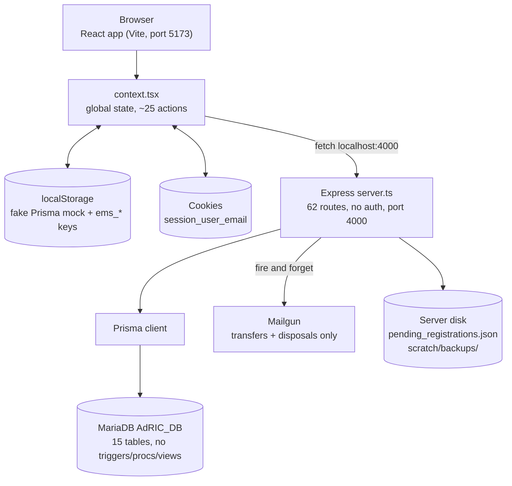

# 01F. Team Briefing: What the System Really Does

Project: CAP-2519-IT, Asset Management System for DLSU CCS AdRIC.
Date: 2026-09-26. Presenter: Raiki. Meeting length: about 30 minutes. Reading time for sections 1 to 10: about 15 minutes.

Sources: [01A](01A-system-trace.md) (trace), [01B](01B-findings-register.md) (findings), [01C](01C-security-map.md) (security), [01E](01E-onboarding-roadmap.md) (onboarding). Finding IDs like `H-04` point into 01B. Feature IDs like `F-16` point into 01A section 6.

Spot check on 2026-09-26: `server.ts` is still 4,760 lines, `scratch/backups/` still has 113 tracked files, `app.use(cors())` is still open at L11, and no auth middleware exists. Nothing found in Phase 1B has changed since.

No credentials, emails, or ID numbers appear in this document. Sensitive files are referred to by path, count, and field name only.

---

## 1. TL;DR

- The app looks finished, but the server behind it checks nothing. Anyone who can reach port 4000 can read, approve, create, or delete anything (C-02).
- Real passwords are in plain text inside our repository: 113 backup files plus one pending-registrations file (C-01, C-03). This is the most urgent problem and it is mostly a housekeeping fix.
- Several screens look like they save but only write to the browser: approvals from the notification bell, custodian return requests, and inspection scheduling (H-01, H-02, H-18).
- Some numbers on screen are invented or always zero: fallback chart data, the compliance percentage, delinquencies that never clear (H-09, H-12, H-04).
- What is solid: the core write endpoints for intake, loan/transfer/disposal decisions, and inspections use real transactions. The foundation is repairable. Most fixes are small.

---

## 2. Meeting agenda (30 minutes)

| Time | Section | What we do |
|---|---|---|
| 2 min | 1. TL;DR | Set the tone |
| 8 min | 3. How the system works today | Roles, the big picture, ten workflows |
| 3 min | 4. Health check | Reliable, by luck, broken |
| 6 min | 5. The extreme cases | Criticals, Highs by theme, demo risks |
| 3 min | 6. Security in one page | Attack surface, Data Privacy Act, tiers |
| 3 min | 7. Documentation impact | What we must not claim |
| 4 min | 8 and 9. Decisions and next steps | Agree, assign owners |
| 1 min | Wrap | Restructure plan (01D) is a separate agenda item |

---

## 3. How the system works today

### 3a. The big picture

**Simple version:** three moving parts. A website in the browser, a server program on one laptop, and a database on a DLSU server. The website always calls `localhost:4000`, so it only works on the machine running the server (M-08). Some actions never leave the browser at all.

**Technical version:**

How a click travels: a React screen calls a `fetch` (often inside `context.tsx`), which hits an Express route in `server.ts`. The handler talks to MariaDB through Prisma and returns JSON. Then, in several places, the screen **also** writes a second copy into the localStorage mock (F-10, F-16, F-23). The mock is the confusing part: `src/app/prismaClient.ts` is not Prisma, it is a fake database in the browser (01A section 5).

One more idea to hold onto: an asset's current state is not a column. It is the **newest row** in the append-only `asset_records` log (01E section 3).

### 3b. Roles and what each can do

| Role | Main screens | Key actions | Persists (database) | Browser only |
|---|---|---|---|---|
| Custodian (student or faculty) | My Assets, Available, QR scan, Inspection report | Borrow, transfer, repair request, inspection report, return request | Borrow, transfer, repair, inspection | Return request (H-02) |
| Lab Head | Custody, Inventory, Health, Approvals | Approve or decline loans and transfers, approve registrations, print audit | Loan and transfer decisions from dashboard, registration approval | Audit print (nothing stored) |
| ITS and TSG (same screens in practice) | 8 tabs: overview, register, inventory, repairs, inspections, returns, QR tags, health | Register, edit, delete assets, finalize returns, repair progress, disposal request | Intake, edit, returns, repairs, disposal request | Inspection schedule (H-18), pending returns ledger (H-02) |
| AdRIC Director | Overview, analytics, approvals and holds, audit generator | Approve disposals, view analytics, place clearance holds | Disposal decision from dashboard | Clearance holds (F-37), bell approvals (H-01) |

Role gating exists in React only. The server enforces none of it (01A section 8). `ITS_STAFF` and `ADRIC_SECRETARY` are not mapped properly (M-11).

### 3c. The core workflows

**Registration and login**
*What the user sees:* A student fills a sign-up form. A Lab Head approves it. The student logs in with email and password.
*What actually happens:* `POST /api/auth/register-request` (`server.ts` L3722) appends to `pending_registrations.json`, not the database, with the password in clear text (F-04, H-17). Approval (L3769) creates the `users` rows, and if the request id is unknown it builds the account from the request body (C-05). Login (L3886) matches email and password inside the SQL `WHERE` (C-03). "Logged in" afterward is just an email in a cookie (C-06, F-02). If the API rejects the login, the screen retries against the browser mock and can still log you in as Custodian (F-01).
*Why it matters:* Registering creates nothing in the database. Identity is forgeable in seconds. This is the weakest workflow.

**Asset intake**
*What the user sees:* ITS or TSG walks through a wizard, enters the equipment details, and gets an asset tag.
*What actually happens:* `POST /api/assets` (L512) generates the tag, then writes `assets`, `asset_monetary`, and `asset_records` in one transaction (F-10). Custodian is never asked, so everything is filed under user 1 (`DEFAULT_CUSTODIAN_ID`, L18). An unknown category silently becomes `DEV_KIT`. The tag sequence is read outside the transaction (H-11).
*Why it matters:* This is the best-written handler in the file and a good model. The user-1 shortcut explains a lot of odd data.

**Borrowing**
*What the user sees:* A Custodian picks an available item, fills purpose, due date, and destination lab. The Lab Head approves from their dashboard.
*What actually happens:* `POST /api/assets/:tag/borrow` (L934) finds the borrower by splitting the typed name, defaulting to user 1 (H-10), hides the destination lab inside `purpose` text (H-19), and inserts a `pending` loan. It never checks whether the asset is already on loan (H-05). Approval (L986) is transactional and appends an `ON_LOAN` record, but two simultaneous approvals can both pass (H-11).
*Why it matters:* The approval side is solid. The request side can create loans for the wrong person on an item that is not available.

**Returning**
*What the user sees:* A Custodian submits a return request. TSG finalizes it after inspecting the item.
*What actually happens:* The custodian's request is stored in `localStorage.ems_returns` only (F-21, H-02). TSG's finalize step (L1326) does write to the database, but it never closes the loan (H-04), and returns in Minor Drift or Critical Defect fail because of an enum mismatch (H-21).
*Why it matters:* The request half is invisible to other machines, and the finalize half leaves loans open forever and breaks on the two worst conditions.

**Transfer**
*What the user sees:* A Custodian types a recipient's email, a lab, a date, and a reason. A Lab Head approves.
*What actually happens:* `POST .../transfer` (L1454) is the one endpoint that refuses to guess the person: it needs a real recipient email. It stores the lab inside the `justification` text and drops the effective date (H-19). Approval (L1594) sets the asset to `ON_LOAN` under the new custodian, which is misleading. Approving from the notification bell saves nothing (H-01).
*Why it matters:* Who decides (recipient or Lab Head) is an open design question (01A section 10, HANDOFF question 1). The panel comment S1 is still unresolved.

**Repair**
*What the user sees:* A Custodian files a repair request. TSG moves the ticket through statuses.
*What actually happens:* `POST .../repair` (L1078) fires twice from the form and only works because an 8-second in-memory guard swallows the duplicate (M-07). The status update has two endpoints with different effects: the dialog moves the asset into maintenance, the kanban does not (H-06). Any string is accepted as a status, and "Waiting for Parts" already exists in live data (H-07). The warranty is never checked (S3).
*Why it matters:* Works today by luck. The same action produces different data depending on the screen.

**Inspection**
*What the user sees:* A Custodian submits a condition report. ITS and TSG run a scheduled inspection queue.
*What actually happens:* The custodian report reaches the database (L763), but `reportedById` is always undefined because of a field-name bug (H-13). The ITS scheduling screen keeps everything in component state, so it forgets on navigation, and its reset dialog claims records are safe (H-18). Inspector name is recorded as "undefined undefined" (H-13). Editing an asset overwrites the newest history row (H-14).
*Why it matters:* Individual reports persist. The scheduling screen is a prototype presented as a feature.

**Disposal**
*What the user sees:* ITS files a disposal request. The Director approves it.
*What actually happens:* `POST .../disposal` (L1720) packs pathway, last custodian, and target date into one text column (M-13) and emails everyone holding the Director role. Nobody holds that role in the seed, so the email goes to no one (H-22). Approval from the dashboard is transactional (L1824). Approval from the bell does nothing in the database (H-01). Disposed assets can still be borrowed, since no endpoint checks status (H-05).
*Why it matters:* Dashboard path is fine. The bell path shows success and saves nothing.

**Notifications**
*What the user sees:* A bell with requests, reminders, and clearance holds, with approve buttons.
*What actually happens:* Everything is derived from context state in one large `useMemo` (F-31). Lab Head relevance is hardcoded to "CITe4D" or "Manila" (M-04). Faculty status is guessed from a literal name and emails are invented from display names (M-05). Only the loan button calls the real API.
*Why it matters:* Two of three approval buttons in the bell do not save. Other Lab Heads see empty or wrong lists.

**Analytics**
*What the user sees:* Charts for Director, Lab Head, and TSG.
*What actually happens:* 30 analytics routes exist, only 8 have a live screen calling them (01A section 6.11). Four responses substitute made-up series when data is empty (H-09). The compliance percentage reads a column that does not exist and is always zero (H-12). Delinquencies never clear (H-04). About 2,670 frontend lines are dead code (M-06).
*Why it matters:* Numbers on screen may not come from the data. If a panel member asks where a figure came from, we may not have an answer.

---

## 4. Health check

| Works reliably | Works by luck | Actively broken |
|---|---|---|
| Asset intake, edit, and inspection writes are transactional (01B section 5) | Repair submissions, saved by an 8-second memory guard (M-07) | Bell approvals for transfers and disposals save nothing (H-01) |
| Loan, transfer, disposal decision endpoints when called from dashboards | Lab Head analytics, unless a user has no center row (M-14) | Custodian return requests never leave the browser (H-02) |
| `GET /api/assets` gives a consistent, heavy registry view | "Latest record" reads, unless two writes land in one second (M-09) | Deleting an inspected asset always fails (H-03) |
| QR generation and camera scanning | Login mock fallback, which rarely triggers (F-01) | Delinquencies never clear (H-04) |
| Email for transfers and disposals, when Mailgun variables are set | Asset tag allocation, unless two people register at once (H-11) | Compliance percentage always zero (H-12) |
| Lab Head branch filtering, for users with a `user_centers` row | Role routing, only for the five roles anyone tests (M-11) | Inspection scheduling forgets everything (H-18) |
| Mailgun credentials kept out of the repo (01C section 5) | Custodian "My Assets", unless two people share a display name (F-09) | Inspector recorded as "undefined undefined" (H-13) |
| | | Returns in Minor Drift or Critical Defect rejected (H-21) |
| | | Seeded Director lands in the student portal (H-22) |
| | | Schema SQL file stops at the third table (H-23) |
| | | `npm run seed` throws (L-04) |
| | | Prisma CLI fails while the server works (C-07, 01C section 7) |

---

## 5. The extreme cases

### 5a. The 7 Critical findings

**C-01: Passwords are in our repo.** A backup timer in `server.ts` (L4717 to L4750) dumps the users table, password field included, into `scratch/backups/` at startup and every 6 hours. Git tracks the folder: 113 files, the newest holding 25 user rows, none hashed. Anyone who clones the repo has working credentials, and deleting the files does not remove them from git history. Fix: stop dumping `users`, untrack and ignore the folder, rotate passwords, decide with the adviser about history. Effort: M.

**C-02: The server has no authentication or authorization.** None of the 62 routes checks who is calling, and CORS is open to every origin (`server.ts` L11). The role system is buttons in React. Anyone on the network can send `PUT /api/asset_disposals/3/decision` or `DELETE /api/assets/<tag>` and it works. Fix: session layer, `requireAuth` middleware, per-route role checks, restricted CORS. Effort: L.

**C-03: Passwords are plain text everywhere.** Registration stores them raw, login compares them inside the SQL `WHERE` (L3894), and the match is case-insensitive because of the column collation. The browser mock ships 11 demo passwords in source. Fix: hash with bcrypt or argon2, compare in code, never select the column. Effort: M.

**C-04: An open endpoint hands out pending credentials.** `GET /api/auth/pending-registrations` (L3717) returns the whole pending list, password included, to anyone, and the frontend calls it for every role. Fix: require Lab Head auth, strip the field, stop storing the password. Effort: S.

**C-05: Anyone can create an account with a role.** If the request id is unknown, `approve-registration` (L3769) builds the user from the request body, and the role text is mapped by substring. One request creates an ADMIN or LAB_HEAD. Fix: remove the body fallback, require a real pending record and an authenticated Lab Head. Effort: S.

**C-06: The session is an unsigned email in a cookie.** On load the app sends the cookie's email to `/api/auth/me` and adopts the returned role (`context.tsx` L466). Editing one cookie value turns a student into the Director, with no password. Fix: signed httpOnly session or JWT issued at login. Effort: M.

**C-07: Database credentials are hardcoded in tracked code.** `prisma.ts` L5 to L15 has literal defaults for host, port, user, database, and password, used because no `.env` exists. Anyone with the repo can connect to the shared database directly. The fallback also hides missing config. Fix: remove fallbacks, fail fast, add `.env.example` (names only), rotate the password. Effort: S.

### 5b. High findings by theme

**Data that silently does not save**
- H-01: Bell approvals for transfers and disposals write only to localStorage.
- H-02: Custodian return requests exist only in the submitting browser.
- H-18: Inspection scheduling state is lost on navigation.
- H-19: Transfer effective date is dropped, destination lab hidden in text.
- H-21: Two of five return conditions cannot be saved.
- H-14: Editing an asset overwrites history instead of appending.

**Wrong or invented data**
- H-04: A return never closes its loan, so delinquency is permanent.
- H-08: `GET /api/asset_loans` inserts a fake loan (id 9).
- H-09: Analytics return made-up series when data is empty.
- H-10: The acting user is guessed from a typed name, defaulting to user 1.
- H-12: Compliance metric reads a column that does not exist.
- H-13: No type checking, so field-name bugs write "undefined undefined".
- H-06: Two repair endpoints with different side effects.

**Missing guards**
- H-03: Delete wipes history, or fails if the asset was ever inspected.
- H-05: No state checks: you can borrow a loaned or disposed asset.
- H-07: Status columns are free text and accept anything.
- H-11: Uniqueness and pending checks run outside their transactions.
- H-16: Raw database errors are returned to the browser.
- H-20: User text goes unescaped into emails and printed HTML.

**Schema and tooling**
- H-15: No migrations, schema changed by hand with raw SQL scripts.
- H-17: Sign-up requests live in a JSON file next to the code.
- H-22: The seeded Director is given the Custodian role, nobody holds ADRIC_DIRECTOR.
- H-23: The schema SQL file does not run (two typos).

### 5c. Top demo and defense risks

| Risk | What the panel would see | Finding |
|---|---|---|
| Passwords in the repository | Open `scratch/backups/`, read credentials | C-01 |
| Anyone can approve or delete without logging in | One terminal command changes data mid-demo | C-02, C-05, C-06 |
| A loan nobody created | "Where did loan 9 come from?" Loading the page created it | H-08 |
| Charts built from constants | "Which assets produced this curve?" None | H-09 |
| Director approves a disposal and nothing saves | Still pending after refresh on another machine | H-01 |
| Return request TSG cannot see | Demo only works on one laptop and one browser profile | H-02 |
| "It only works on my machine" | Every URL is `localhost:4000` | M-08 |
| Compliance reads 0 percent | Suggests no grant equipment is documented | H-12 |
| Delete fails with a raw SQL error | Foreign key error on `fk_reports_asset` shown to user | H-03, H-16 |
| Director cannot act as Director | Seeded Director opens the student portal | H-22 |
| Damaged return refused | Critical Defect return fails at the database | H-21 |
| Inspection schedule vanishes | Set up, navigate away, gone | H-18 |
| Panel comments still open | S1, S2, S3, S4, S5, S6, S7, D1, D2 | H-19, M-03, M-15 and Phase 3 |

---

## 6. Security in one page

**Attack surface (01C section 2).** One open door with 62 routes on port 4000, CORS open to every origin, a 50 MB body limit, no rate limiting, no HTTPS. The browser bundle ships 11 demo accounts with passwords. The database is reachable directly from anyone holding the repo. Emails and the QR print window paste typed text unescaped. The repository itself is the easiest place to get credentials.

**How identity can be forged today (01C section 3.2).**
- Edit the `session_user_email` cookie to another address: full session as that person (C-06).
- Call any endpoint directly with curl or Postman: everything works (C-02).
- Read a committed backup and log in normally (C-01).
- Call `GET /api/auth/pending-registrations`: credentials of applicants (C-04).
- Call `POST /api/auth/approve-registration` with an invented body: a new privileged account (C-05).

**What the Data Privacy Act mapping means for us (01C section 8, panel comment D2).** We committed to nine protections in the proposal. Today the system provides none of them: no access control, credentials published, no minimization, no retention or erasure path, no audit trail, and no way to detect a breach. Two actively work against us (credentials published, no logs). Closing D2 honestly means changing the system, not only the paper.

**Remediation tiers (01C section 9).**

| Tier | When | Items |
|---|---|---|
| **1** | Before any further demo (mostly deletions) | 1 stop backup including `users` and stop writing in the repo; 2 add `scratch/backups/` and `pending_registrations.json` to `.gitignore` and untrack; 3 rotate every exposed password and the DB password; 4 decide with adviser about git history rewrite; 5 remove hardcoded DB fallbacks; 6 remove `password` from the pending and approve responses; 7 remove the request-body fallback in approve-registration |
| **2** | Before the next defense | 8 hash passwords; 9 real signed session; 10 `requireAuth` plus per-route role checks; 11 acting user from the session, drop `DEFAULT_CUSTODIAN_ID`; 12 restrict CORS, configurable port and API URL; 13 one error middleware; 14 escape email and print output; 15 `audit_log` table; 16 remove mock login fallback and demo passwords from the bundle |
| **3** | Before real data | 17 HTTPS and `Secure` cookies; 18 rate limiting, lockout, password reset; 19 retention and deletion (D2); 20 images out of the database; 21 server-side lab scoping; 22 dependency auditing |

---

## 7. Documentation impact

| Document | Section | What to write or correct | Finding |
|---|---|---|---|
| Capstone paper | System Security / RBAC | Do not claim role-based access control is enforced. It exists in the UI only and the API accepts any call. Describe it as designed and state implementation status honestly | C-02, 01A section 8 |
| Capstone paper | Authentication | Do not claim secure authentication or password protection. Passwords are plain text, session is an editable cookie. Say hashing and signed sessions are planned (Tier 2) | C-03, C-06 |
| Capstone paper | Data Privacy Act compliance (D2) | Do not claim compliance. Present the 01C section 8 mapping, say what is missing, and give the remediation plan. No retention, erasure, or audit trail exists | 01C section 8 |
| Capstone paper | Chain of custody / accountability | Do not claim a reliable custody trail. The actor is often guessed as user 1, history can be overwritten, and no state guards exist | H-10, H-14, H-05 |
| Capstone paper | Workflow descriptions | Describe returns as two halves: the request is browser-only, only finalization reaches the database. Say a return does not close its loan. Do not present inspection scheduling as a persistent feature | H-02, H-04, H-18 |
| Capstone paper | Transfers | State the approver is undecided (recipient or Lab Head). Do not claim effective date or destination lab are stored as fields | H-19, open question 1 |
| Capstone paper | Analytics and reporting | Do not present compliance, degradation, or delinquency figures as measured data until H-09, H-12, H-04 are fixed. Only 8 of 30 analytics endpoints are live | H-09, H-12, H-04, M-06 |
| Capstone paper | Database design | Say there are no triggers, procedures, or views, and no migrations. Panel comment is correct. Reference the Phase 3 plan | H-15, 01A section 1 |
| Capstone paper | Limitations | Add a limitations section: single-machine only (localhost URL), shared live database, no tests, no type checking | M-08, M-18, H-13 |
| Setup guide | Prerequisites and `.env` | List the variable names (`DATABASE_HOST`, `DATABASE_PORT`, `DATABASE_USER`, `DATABASE_PASSWORD`, `DATABASE_NAME`, `DATABASE_URL`, `MAILGUN_*`). Warn that a fresh clone silently uses hardcoded fallbacks | C-07, 01E section 4 |
| Setup guide | `npm run seed` | Mark as broken. Do not tell readers to run it | L-04 |
| Setup guide | `generated/prisma/` | Remove. That folder does not exist, the client lands in `node_modules` | 01E section 4 |
| Setup guide | Prisma CLI | Explain `DATABASE_URL` is separate from the five variables the server uses | 01E section 4, C-07 |
| Setup guide | Creating your own database | Say the schema SQL does not run yet (two typos). Everyone shares one live database, so treat writes as production | H-23 |
| Setup guide | Type checking and tests | State there is no `tsconfig.json`, no typecheck, and no tests. Trust the editor, not the build | H-13, M-18 |
| User manual | Return workflow | Tell custodians a return request is only visible on their own browser until fixed. Do not describe it as notifying TSG | H-02 |
| User manual | Approvals | Tell approvers to use the dashboard, not the notification bell, for transfers and disposals | H-01 |
| User manual | Inspection scheduling | Label as prototype, schedules are not saved | H-18 |
| User manual | Roles | Document only the four working roles. `ITS_STAFF` and `ADRIC_SECRETARY` are not supported | M-11 |
| README | Setup and structure | Correct the setup steps per the setup guide rows. Add a pointer to `docs/README.md` | 01E section 4 |
| Adviser report | Status and risk | Report the Critical findings honestly, the Tier 1 actions taken, and the git history decision. Include the demo risk table | 01B section 6, 01C section 9 |

---

## 8. Decisions we need to make today

1. **Do we do all seven Tier 1 items before the next demo?** Yes or no. *Recommend: yes.* They are mostly deletions and they stop new credentials being written every 6 hours.
2. **Do we rewrite git history to remove the credentials?** A: rewrite. B: rotate everything, do not rewrite, record the decision. *Recommend: rotate now regardless, then ask the adviser and decide based on who has cloned the repo.* This one is open.
3. **Do we fix the three one-line defects first (H-21, H-22, H-23)?** Yes or no. *Recommend: yes.* H-23 also unblocks a test database for Phase 2.
4. **Who approves a transfer: the recipient or the Lab Head?** A: Lab Head (what the UI does today). B: recipient, then Lab Head. *Recommend: A for now, record recipient acceptance as a Phase 3 item.* Open question 1 in the HANDOFF.
5. **Are we willing to state in the paper that RBAC and Data Privacy Act compliance are designed but not fully implemented?** Yes or no. *Recommend: yes.* A false claim is worse than an honest gap.
6. **For the next demo, do we script a safe path?** A: demo only the dashboard paths and avoid the bell approvals, return requests, and inspection scheduling. B: fix those first. *Recommend: A for the next demo, B as follow-up.*
7. **Inspection scheduling: persist it or label it a prototype?** A: persist (M). B: label as prototype for now. *Recommend: B for now.* Deferred open question 15.
8. **Dead analytics code: quarantine or re-attach?** A: quarantine in `legacy/analytics-v1/` (01D). B: re-attach to the router. *Recommend: A.* Open question 5.
9. **Do we split the restructure into its own meeting?** Yes or no. *Recommend: yes.* See 01D. It reorganizes files, but fixes none of the findings (01D section 12).

---

## 9. Next steps

Effort: S up to one day, M one to three days, L more than three days (01B).

| Owner | Task | Findings | Effort |
|---|---|---|---|
| [name] | Stop backup of `users`, ignore and untrack `scratch/backups/` and `pending_registrations.json` | C-01, M-19 | S |
| [name] | Rotate all exposed passwords and the database password | C-01, C-07 | S |
| [name] | Remove hardcoded DB fallbacks, add `.env.example` | C-07 | S |
| [name] | Strip password from pending and approve responses, remove body fallback | C-04, C-05 | S |
| [name] | Talk to the adviser about git history | C-01 | S plus decision |
| [name] | Fix return enum mapping, Director seed row, SQL typos | H-21, H-22, H-23 | S |
| [name] | Remove the GET that writes and the invented analytics fallbacks | H-08, H-09 | S |
| [name] | Point bell approvals at the real endpoints | H-01 | S |
| [name] | Hash passwords and add a real session with `requireAuth` | C-02, C-03, C-06 | L |
| [name] | Persist return requests and close loans on return | H-02, H-04 | M |
| [name] | Update capstone paper claims per section 7 | C-02, C-03, D2 | M |
| [name] | Write the corrected setup guide and README | 01E section 4 | S |
| [name] | Restructure discussion (separate item) | 01D | L |

---

## 10. Speaker notes

**Section 1, TL;DR (about 2 minutes)**
- Okay, so I read all the Phase 1B docs. Here's the short version.
- The app looks good. But the server behind it doesn't check who anyone is.
- Passwords are sitting in plain text in our repo. That's the scary one.
- Some buttons look like they save and don't. Some charts show numbers nobody measured.
- The good news: the core is solid and most fixes are small.

**Section 2, Agenda (about 1 minute)**
- We've got about 30 minutes. I'll explain how it works first, since not everyone has seen `server.ts`.
- Then what's broken, then security, then what it means for our writing.
- We finish with decisions. I need real answers on those, so keep them in mind.

**Section 3, How it works (about 8 minutes)**
- Think of three parts: browser, server, database. The browser always calls localhost, so it only works on one machine.
- The confusing bit is the fake Prisma in the browser. Some actions write only there.
- Walk the borrowing example. Request side is shaky, approval side is solid.
- Registration is the surprise. Signing up doesn't touch the database at all. It's a JSON file.
- Returns are half and half. The student's request stays in their browser.
- Don't rush the roles table. Ask if anyone was surprised.

**Section 4, Health check (about 3 minutes)**
- Three lists. Reliable, works by luck, broken.
- The luck list matters. Repairs only work because a memory guard swallows a duplicate call.
- The broken list is all things we could have shown a panel as working.
- Point out the good stuff too. Mailgun keys are handled right.

**Section 5, Extreme cases (about 6 minutes)**
- Seven Criticals. I'll go through them fast. Pause on C-01 and C-06.
- C-01: real passwords in the repo, 113 files. Deleting them isn't enough, git remembers.
- C-06: change one cookie and you're the Director. I can show that in dev tools if we have time.
- The Highs are grouped so you can see the pattern: things that don't save, wrong data, missing guards.
- Demo risk table: read out three or four. Loan 9 is my favorite. Loading a page created it.

**Section 6, Security (about 3 minutes)**
- No lock on the door. The website hides menus, the server answers anyone.
- Data Privacy Act: we promised nine protections in the proposal. We deliver none today.
- That's not a reason to panic. It's a reason to fix the system, not just the paper.
- Tier 1 is mostly deletions. Tier 2 is the real work. Tier 3 is before real data.

**Section 7, Documentation impact (about 3 minutes)**
- This is why we're here. We're about to write the paper.
- We cannot write RBAC is enforced. We cannot write Data Privacy Act compliant.
- We can write what's designed and what's implemented. That's honest and defensible.
- Setup guide: several steps in the README are just wrong. `seed` throws, the schema file doesn't run.

**Section 8 and 9, Decisions and next steps (about 4 minutes)**
- I'll read each decision and my recommendation. Say yes, no, or argue.
- Decisions 1 and 2 first. Those affect everything else.
- Then let's put names in the next steps table before we leave.
- Restructure plan is its own meeting. See 01D. It moves files, it doesn't fix findings.

---

## Appendix A: Glossary

| Term | Meaning here |
|---|---|
| Authentication | Proving who you are (login). We check the password once, then trust a cookie |
| Authorization | Deciding what you may do once we know who you are. Not implemented on the server |
| API | The set of `/api/...` addresses the browser calls on the server |
| Middleware | Code that runs on every request before the route, where auth checks belong |
| Transaction | A group of database writes that all succeed or all fail together |
| Migration | A versioned, reviewable change to the database structure. We have none (H-15) |
| State guard | A check that an action is allowed in the current state, for example not lending a disposed asset (H-05) |
| Enum | A fixed list of allowed values. Our status columns are free text instead (H-07) |
| Trigger | Database code that runs automatically when a row changes. None exist yet |
| Stored procedure | Reusable logic saved in the database. None exist yet |
| Append-only log | A table where you only add rows, never edit. `asset_records` is meant to be one (H-14) |
| localStorage | Browser storage, private to one browser on one machine. The reason returns are invisible to TSG |
| Cookie | A small value the browser keeps and sends back. Ours holds an email (C-06) |
| CORS | Rules about which websites may call an API. Ours allows all of them (C-02) |
| Hashing | One-way scrambling of a password so it cannot be read back. We do not do it (C-03) |
| Race condition | Two actions at once giving a wrong result, such as two approvals both passing (H-11) |
| Foreign key | A database link between tables. It is why deleting inspected assets fails (H-03) |
| Base64 image | A picture turned into text and stored in the row (M-17) |
| Tier 1, 2, 3 | Priority order of security fixes in 01C section 9 |

---

## Appendix B: Full finding index

Where explained: findings are in the 01B master table (section 2). Critical and High findings also have detail in 01B sections 3 and 4. Security context is in 01C.

### Critical

| ID | Severity | Title | Explained in |
|---|---|---|---|
| C-01 | Critical | User table with plaintext passwords committed to the repository | 01B s3, 01C s2.6, s5, s9 |
| C-02 | Critical | The API has no authentication or authorization at all | 01B s3, 01C s4, 01A s8 |
| C-03 | Critical | Passwords stored, compared, and transported in clear text | 01B s3, 01C s3, s9 |
| C-04 | Critical | Open endpoint returns pending registrations including passwords | 01B s3, 01C s4.1 |
| C-05 | Critical | Anyone can create an account with a role through one endpoint | 01B s3, 01A F-05 |
| C-06 | Critical | Session is a plain, unsigned cookie holding an email | 01B s3, 01C s3.2, 01A F-02 |
| C-07 | Critical | Live database credentials hardcoded as fallbacks in tracked code | 01B s3, 01C s7 |

### High

| ID | Severity | Title | Explained in |
|---|---|---|---|
| H-01 | High | Notification Center approvals never reach the database | 01B s4, 01A s5.2 |
| H-02 | High | Custodian return requests exist only in the submitting browser | 01B s4, 01A F-21 |
| H-03 | High | Deleting an asset destroys history, or fails if inspected | 01B s4, 01A F-12 |
| H-04 | High | A return never closes its loan | 01B s4, 01A F-22 |
| H-05 | High | No endpoint checks an asset's current state before acting | 01B s4, 01A F-16, F-18 |
| H-06 | High | Two repair endpoints with different side effects | 01B s4, 01A F-25, F-26 |
| H-07 | High | Workflow status columns are free text | 01B s4, 01A s7.2 |
| H-08 | High | A GET endpoint writes to the database | 01B s4, 01A F-41 |
| H-09 | High | Analytics invent data when the database is empty | 01B s4, 01A s6.11 |
| H-10 | High | Acting user guessed from a typed name, defaulting to user 1 | 01B s4, 01A s9.8 |
| H-11 | High | Uniqueness and state checks happen outside transactions | 01B s4 |
| H-12 | High | A compliance metric reads a column that does not exist | 01B s4, 01A s1 C9 |
| H-13 | High | TypeScript is never type-checked, real type bugs live | 01B s4, 01A F-28 |
| H-14 | High | Editing an asset rewrites the newest history row | 01B s4, 01A F-11 |
| H-15 | High | No migrations, schema changed by hand with raw SQL | 01B s4 |
| H-16 | High | Raw database errors returned to the browser | 01B s4, 01A s9.1 |
| H-17 | High | Sign-up requests live in a JSON file next to the code | 01B s4, 01A F-04 |
| H-18 | High | Inspection scheduling keeps nothing | 01B s4, 01A F-28 |
| H-19 | High | Transfer details dropped or hidden in text | 01B s4, 01A F-18 |
| H-20 | High | User text interpolated into email and print HTML unescaped | 01B s4, 01C s6.2 |
| H-21 | High | Two of five return conditions cannot be saved | 01B s4, 01A s3.5 |
| H-22 | High | Seeded Director holds the wrong role, nobody holds ADRIC_DIRECTOR | 01B s4, 01A s3.5 |
| H-23 | High | The schema file cannot be executed | 01B s4, 01A s3.5, 01E s4 |

### Medium

| ID | Severity | Title | Explained in |
|---|---|---|---|
| M-01 | Medium | Main asset endpoint reads nine whole tables per request | 01B s2, 01A F-09 |
| M-02 | Medium | Lab scoping is fuzzy string matching in the browser only | 01B s2, 01C s9 item 21 |
| M-03 | Medium | Six disagreeing lab lists, none from the database table | 01B s2, 01A s9.7 |
| M-04 | Medium | Notification relevance hardcoded to one lab | 01B s2, 01A F-31 |
| M-05 | Medium | Fabricated identities in the clearance list | 01B s2, 01A F-31 |
| M-06 | Medium | Large amounts of dead code | 01B s2, 01A s3.4 |
| M-07 | Medium | Every repair request is submitted twice | 01B s2, 01A F-23 |
| M-08 | Medium | API base URL hardcoded in over twenty places | 01B s2, 01C s7 |
| M-09 | Medium | "Newest record" ordering is unreliable | 01B s2, 01A s9.6 |
| M-10 | Medium | Native alert and confirm used for workflow decisions | 01B s2, 01A s9.3 |
| M-11 | Medium | Role mapping gaps | 01B s2, 01A s8 |
| M-12 | Medium | A dead endpoint would permanently stall a transfer | 01B s2, 01A F-20 |
| M-13 | Medium | Disposal details packed into one text column | 01B s2, 01A F-29 |
| M-14 | Medium | Lab Head analytics break for a user with no center row | 01B s2, 01A s6.11 |
| M-15 | Medium | QR flow has no recorded manual fallback (panel D1) | 01B s2, 01A F-15 |
| M-16 | Medium | Acquisition value cannot be corrected after intake | 01B s2, 01A F-11 |
| M-17 | Medium | Images stored as base64 in the database and every payload | 01B s2, 01C s6.3 |
| M-18 | Medium | No tests of any kind | 01B s2, 01E s4 |
| M-19 | Medium | `.gitignore` does not cover the data files | 01B s2, 01C s7 |
| M-20 | Medium | Documentation describes a structure that no longer exists | 01B s2 |

### Low

| ID | Severity | Title | Explained in |
|---|---|---|---|
| L-01 | Low | Emoji console logging, including full request bodies | 01B s2, 01A s9.5 |
| L-02 | Low | Artificial one-second delay on login | 01B s2, 01A F-01 |
| L-03 | Low | `@types/react` v19 against React 18 runtime | 01B s2 |
| L-04 | Low | The seed script is broken | 01B s2, 01E s4 |
| L-05 | Low | Session cookies have no Secure, SameSite, or HttpOnly flags | 01B s2, 01C s2.7 |
| L-06 | Low | Vite resolves `figma:asset/*` to a folder that does not exist | 01B s2, 01A s3.6 |
| L-07 | Low | Inconsistent endpoint naming | 01B s2, 01E s7 |

---

Open items that are labeled open rather than fact: who approves a transfer (01A s10, HANDOFF question 1); whether inspection scheduling should persist (HANDOFF question 15); whether `cycleMode` is policy or preference (HANDOFF question 16); whether the deployed demo ever ran the frontend on another machine (01A s10 item 3); whether `pending_registrations.json` is live data (01A s10 item 4); whether the dead analytics should be deleted or re-attached (01A s10 item 5). The restructure plan is a separate discussion: see [01D](01D-restructure-plan.md), and section 12 there for what it does not fix.
